# Руководство администратора Системы EMS v4.2.0

## Аннотация

"Element Management System" ("Система управления объектами инфраструктуры") (далее – Система, EMS) – геораспределенная система мониторинга и управления объектами инфраструктуры.

Документ содержит информацию, необходимую для администрирования ПО EMS версии 4.2.0.

Настоящий документ является составной частью комплекта технической документации на систему EMS и разработан в соответствии с требованиями ГОСТ 2.105-95 «Единая система конструкторской документации. Общие требования к текстовым документам».

## 1 Введение

### 1.1 Область применения <!-- {docsify-ignore} -->

Система EMS предназначена для решения следующих бизнес-задач в IT-инфраструктуре компании:

- Снижение расходов на использование нескольких систем, за счет централизованного мониторинга аппаратных и программных (виртуальные машины, гипервизоры, сервисы) ОМиУ (объектов мониторинга и управления) в системе;
- Снижение времени на выполнение задач по обновлению и установке операционных систем и прошивок, за счет централизованной панели управления и возможности массового запуска операций на ОМиУ;
- Снижение времени реагирования на инциденты, за счет формирования необходимого представления инфраструктуры, выделения ОМиУ, требующих более пристального внимания и возможности настройки разных способов оповещения о событиях.

### 1.2 Назначение системы  <!-- {docsify-ignore} -->

Система EMS предназначена для:

- Автоматизации задач управления серверным оборудованием;
- Автоматизации задач управления сетевым оборудованием;
- Мониторинга в режиме реального времени доступности серверов, устройств хранения и сетевых коммутаторов;
- Мониторинга виртуальных машин, гипервизоров, систем и сервисов;
- SMART мониторинга дисков;
- Автоматизации развертывания операционных систем и программного обеспечения;
- Предоставления информации для планирования модернизации оборудования ИТ-инфраструктуры.

Система представляет собой композицию docker-контейнеров. В качестве оркестратора контейнеров используется `docker-compose`.

### 1.3 Термины и определения <!-- {docsify-ignore} -->

**Bergen EMS**

| Наименование | Описание |
| --- | --- |
| **EMS**, **Система**   | Element Management System (EMS) - система управления и мониторинга оборудования |
| **Docker**                | Программное обеспечение для автоматизации развёртывания и управления приложениями в средах с поддержкой контейнеризации, контейнеризатор приложений |
| **Docker compose**        | Средство для определения и запуска приложений Docker с несколькими контейнерами |
| **single-node**           | ВМ для размещения EMS |
| **master_cluster**        | Группа сервисов EMS уровней middle и frontend |
| **tool_cluster**          | Группа сервисов EMS уровня бэк-энд |
| **transport_cluster**     | Группа инфраструктурных сервисов. (До EMS 3.3.0 `storage_cluster`) |

**Общие термины и определения**

| Наименование | Описание |
| --- | --- |
| **bash** | (англ. Bourne again shell) - усовершенствованная и модернизированная вариация командной оболочки Bourne shell. Одна из наиболее популярных современных разновидностей командной оболочки UNIX. Особенно популярна в среде Linux, где она часто используется в качестве предустановленной командной оболочки. |
| **firewall** | (англ. firewall «брандмауэр») Персональный межсетевой экран — программное обеспечение, осуществляющее контроль сетевой активности компьютера, на котором он установлен, а также фильтрацию трафика в соответствии с заданными правилами. |
| **FirewallD** | Инструмент управления брандмауэром для операционных систем Linux. Он предоставляет функции брандмауэра, выступая в качестве интерфейса для сетевой фильтрации ядра Linux. |
| **hostname** | (англ. hostname - имя хоста) - метка, которая присваивается устройству, подключенному к компьютерной сети, и используется для идентификации устройства в различных формах электронной связи. |
| **HTTPS** | (англ. HyperText Transfer Protocol Secure) - расширение протокола HTTP, для поддержки шифрования в целях повышения безопасности. Данные в протоколе HTTPS передаются поверх криптографических протоколов SSL или TLS. |
| **IPMI** | Интеллектуальный интерфейс управления платформой, предназначенный для автономного мониторинга и управления функциями, встроенными непосредственно в аппаратное и микропрограммное обеспечения серверных платформ. |
| **ISO** | (англ. International Organization for Standardization) Термин для обозначения образа оптического диска, содержащего файловую систему стандарта ISO 9660. |
| **LDAP** | (англ. Lightweight Directory Access Protocol) - протокол прикладного уровня для доступа к службе каталогов. |
| **localhost**  | Стандартное, официально зарезервированное доменное имя для частных IP-адресов. |
| **MinIO** | Серверное программное хранилище, совместимый с Amazon S3, он может обрабатывать неструктурированные данные, такие как фотографии, видео, файлы журналов, резервные копии и образы контейнеров с максимальным поддерживаемым размером объекта 5 ТБ. |
| **NATS.io** | Система обмена сообщениями с открытым исходным кодом. |
| **OpenSearch** |  Распределённый, управляемый сообществом, лицензированный Apache 2.0, со 100 % открытым исходным кодом комплект поисковых и аналитических ресурсов для различных примеров использования, таких как мониторинг приложений в режиме реального времени, анализ журналов и поиск по веб-сайтам. |
| **PostgreSQL** | Свободная объектно-реляционная система управления базами данных (СУБД). |
| **RPM-based** | (рекурсивный акроним RPM Package Manager — RPM — менеджер пакетов; ранее раскрывался как Red Hat Package Manager — менеджер пакетов Red Hat) — формат пакетов программного обеспечения, а также программа, созданная для управления этими пакетами, используемые в ряде Linux-дистрибутивов; является основным форматом пакетов в LSB. |
| **sh** |  (англ. Shell script) Сценарий командной строки, или сценарий командной оболочки, — программа, выполняемая командной оболочкой операционной системы. Наиболее часто термин применяется к скриптам, написанным для Bourne shell — программной оболочки систем UNIX. |
| **SMTP** |  (англ. Simple Mail Transfer Protocol) - сетевой протокол, предназначенный для передачи электронной почты в сетях TCP/IP. |
| **SNMP** | (англ. Simple Network Management Protocol) - протокол, который используется для управления сетевыми устройствами. С помощью протокола SNMP, программное обеспечение для управления сетевыми устройствами может получать доступ к информации, которая хранится на управляемых устройствах. |
| **SSH** | (англ. Secure Shell ) - сетевой протокол прикладного уровня, позволяющий производить удалённое управление операционной системой и туннелирование TCP-соединений. |
| **SWAP** | Механизм виртуальной памяти, при котором отдельные фрагменты памяти (обычно неактивные) перемещаются из ОЗУ во вторичное хранилище (отдельный раздел или файл), освобождая ОЗУ для загрузки других активных фрагментов памяти. |
| **TCP/IP** | (англ. Transmission Control Protocol и Internet Protocol) — сетевая модель передачи данных, представленных в цифровом виде. Модель описывает способ передачи данных от источника информации к получателю |
| **Telegram** | Кроссплатформенная система мгновенного обмена сообщениями с функциями обмениваться текстовыми, голосовыми и видеосообщениями, стикерами и фотографиями, файлами многих форматов. |
| **TLS** | (англ. Transport Layer Security-защищённый транспортный узел) - протокол безопасности, обеспечивающий защищённую передачу данных между узлами в сети Интернет. |
| **UFW** | Uncomplicated Firewall — это утилита для конфигурирования межсетевого экрана Netfilter. Она использует интерфейс командной строки, состоящий из небольшого числа простых команд. |
| **UEFI** | (англ. Unified Extensible Firmware Interface - единый интерфейс расширяемой прошивки) - интерфейс между операционной системой и микропрограммами, управляющими низкоуровневыми функциями оборудования, его основное предназначение: корректно инициализировать оборудование при включении системы и передать управление загрузчику или непосредственно ядру операционной системы. |
| **volume** | В терминологии docker - хранилище данных, используемое контейнером в процессе работы. |
| **АРМ** | Автоматизированное рабочее место - рабочее место специалиста, оснащенное персональным компьютером, программным обеспечением и совокупностью информационных ресурсов индивидуального или коллективного пользования. |
| **Бакет** | Чтобы разместить файл в объектном хранилище S3, его необходимо поместить в бакет, сущность для организации хранения в хранилище. |
| **ВМ** | Виртуальная машина - абстрактный вычислительный экземпляр, созданные программой, работающей на другой машине (физической), и который физически не существует, но работает, как настоящий компьютер. |
| **Гипервизор** | Программа или аппаратная схема, обеспечивающая или позволяющая одновременное, параллельное выполнение нескольких операционных систем на одном и том же хост-компьютере. Гипервизор также обеспечивает изоляцию операционных систем друг от друга, защиту и безопасность, разделение ресурсов между различными запущенными ОС и управление ресурсами |
| **ИС** | Информационная система |
| **ОМиУ** | Оборудование мониторинга и управления |
| **ОС** | Операционная система |
| **ЦОД** | Центр обработки данных |

## 2 Назначение и условия применения

### 2.1 Виды деятельности и функции администратора

Действия по администрированию Системы выполняет эксплуатационный персонал заказчика в соответствии с ролью:

- Системный администратор - отвечает за следующие процессы:
  - Подготовка инфраструктуры для установки Системы;
  - Установка Системы;
  - Первичное конфигурирование Системы;
  - Установка первой лицензии на Систему;
  - Эксплуатационное сопровождение и конфигурирование Системы;
  - Эксплуатационная установка лицензий на Систему;
  - Подготовка инфраструктуры для обновления Системы;
  - Обновление Системы.

### 2.2 Требования к техническому обеспечению

#### 2.2.1 Общие требования <!-- {docsify-ignore} -->

Для функционирования Системы, необходимо выполнение следующих общих требований:

1. Протокол канала связи - IPv4;
2. Пропускная способность каналов связи между серверами в пределах ЦОД - 1 Гбит/сек;
3. Целевые ОМиУ должны находиться в одной сети с развернутым tool-кластером;
4. Должна быть обеспечена сетевая доступность между transport-кластером и tool-кластером;
5. Должна быть обеспечена сетевая доступность между АРМ оператора и master-кластером;
6. Для выполнения процесса установки необходимо подключиться к ВМ, на которой производится установка по протоколу SSH;
7. Все команды выполняются в консоли от имени пользователя root;
8. Система может функционировать как в открытом, так и закрытом контуре.

#### 2.2.2 Системные требования к развертыванию EMS в режиме HA <!-- {docsify-ignore} -->


> <font color="red">**Внимание:**  развертывание EMS в режиме HA возможно только на ОС Oracle Linux </font>


В режиме HA EMS требует шесть нод с идентичной конфигурацией. Рекомендованные системные требования к аппаратному обеспечению приведены ниже.


##### Требования к дисковой подсистеме

В виду того, что EMS использует высокопроизводительные системы хранения данных, к дисковой подсистеме предъявляются строгие требования:

* Дисковая подсистема должна обеспечивать производительность не менее 15000 IOPS (количество операций ввода-вывода в секунду);
* Для обеспечения оптимальной производительности и стабильности Системы, настоятельно рекомендуется избегать использования сетевых файловых систем в качестве основного хранилища узлов. Применение сетевых файловых систем может привести к снижению производительности кластера, вплоть до потери функциональности;
* Для хранения узлов рекомендуется использовать локальные твердотельные накопители (SSD), установленные непосредственно на физический хост. Это гарантирует повышение эффективности работы Системы и уменьшение вероятности возникновения технических проблем, связанных с хранением данных;
* Рекомендованный необходимый объем дискового пространства для Системы, **без учета пространства занимаемого ОС** и прикладным ПО составляет не менее 300 GB;
* Для корректной работы Системы рекомендуется использовать разметку, при которой все пространство выделено под корневой раздел `/`;
* При наличии особой разметки дисков следует удостовериться что:
  1. В каталоге установки Системы `/opt` доступно не менее 15 GB.
  2. `Docker` для хранения данных, по умолчанию `/var/lib/docker` доступно не менее 275 GB.
  3. В каталоге первоначального размещения инсталляционного пакета `/root` доступно не менее 10 GB.

##### Требования к CPU

К CPU предъявляются строгие требования:
* На каждой ноде должно быть не менее 20 vCPU;
* 64-разрядный процессор с тактовой частотой не менее 2000 Hz.


##### Требования к RAM

К RAM предъявляются строгие требования:
* На каждой ноде должно быть доступно не менее 24 Gb;
* Версия - не ниже DDR4;
* Тип ECC (код исправления ошибок) или аналогичная технология.

##### Требования к сети

Между нодами кластера должно быть обеспечено сетевое соединение со скоростью не 
менее 1 гигабит в секунду.


#### 2.2.3 Системные требования к однонодовой EMS <!-- {docsify-ignore} -->

Рекомендованные системные требования к аппаратному обеспечению приведены ниже.


Рекомендованные системные требования к аппаратному обеспечению приведены ниже.


##### Требования к дисковой подсистеме

В виду того, что EMS использует высокопроизводительные системы хранения данных, к дисковой подсистеме предъявляются строгие требования:

* Дисковая подсистема должна обеспечивать производительность не менее 15000 IOPS (количество операций ввода-вывода в секунду);
* Для обеспечения оптимальной производительности и стабильности Системы, настоятельно рекомендуется избегать использования сетевых файловых систем в качестве основного хранилища узлов. Применение сетевых файловых систем может привести к снижению производительности кластера, вплоть до потери функциональности;
* Для хранения узлов рекомендуется использовать локальные твердотельные накопители (SSD), установленные непосредственно на физический хост. Это гарантирует повышение эффективности работы Системы и уменьшение вероятности возникновения технических проблем, связанных с хранением данных;
* Рекомендованный необходимый объем дискового пространства для Системы, **без учета пространства занимаемого ОС** и прикладным ПО составляет не менее 200 GB;
* Для корректной работы Системы рекомендуется использовать разметку, при которой все пространство выделено под корневой раздел `/`;
* При наличии особой разметки дисков следует удостовериться что:
  1. В каталоге установки Системы `/opt` доступно не менее 15 GB.
  2. `Docker` для хранения данных, по умолчанию `/var/lib/docker` доступно не менее 175 GB.
  3. В каталоге первоначального размещения инсталляционного пакета `/root` доступно не менее 10 GB.

##### Требования к CPU

К CPU предъявляются строгие требования:
* На каждой ноде должно быть не менее 20 vCPU;
* 64-разрядный процессор с тактовой частотой не менее 2000 Hz.


##### Требования к RAM

К RAM предъявляются строгие требования:
* На каждой ноде должно быть доступно не менее 20 Gb;
* Версия - не ниже DDR4;
* Тип ECC (код исправления ошибок) или аналогичная технология.

##### Требования к сети

Между нодами кластера должно быть обеспечено сетевое соединение со скоростью не 
менее 1 гигабит в секунду.


##### Требования к дисковой подсистеме

В виду того, что EMS использует высокопроизводительные системы хранения данных, к дисковой подсистеме предъявляются строгие требования:

* Дисковая подсистема должна обеспечивать производительность не менее 15000 IOPS (количество операций ввода-вывода в секунду);
* Для обеспечения оптимальной производительности и стабильности Системы, настоятельно рекомендуется избегать использования сетевых файловых систем в качестве основного хранилища узлов. Применение сетевых файловых систем может привести к снижению производительности кластера, вплоть до потери функциональности;
* Для хранения узлов рекомендуется использовать локальные твердотельные накопители (SSD), установленные непосредственно на физический хост. Это гарантирует повышение эффективности работы Системы и уменьшение вероятности возникновения технических проблем, связанных с хранением данных;
* Рекомендованный необходимый объем дискового пространства для Системы, **без учета пространства занимаемого ОС** и прикладным ПО составляет не менее 200 GB;
* Для корректной работы Системы рекомендуется использовать разметку, при которой все пространство выделено под корневой раздел `/`;
* При наличии особой разметки дисков следует удостовериться что:
  1. В каталоге установки Системы `/opt` доступно не менее 15 GB.
  2. `Docker` для хранения данных, по умолчанию `/var/lib/docker` доступно не менее 175 GB.
  3. В каталоге первоначального размещения инсталляционного пакета `/root` доступно не менее 10 GB.

##### Требования к CPU

К CPU предъявляются строгие требования:
* На каждой ноде должно быть не менее 20 vCPU;
* 64-разрядный процессор с тактовой частотой не менее 2000 Hz.


##### Требования к RAM

К RAM предъявляются строгие требования:
* На каждой ноде должно быть доступно не менее 20 Gb;
* Версия - не ниже DDR4;
* Тип ECC (код исправления ошибок) или аналогичная технология.

##### Требования к сети

Между нодами кластера должно быть обеспечено сетевое соединение со скоростью не 
менее 1 гигабит в секунду.

### 2.3 Требования к операционной среде и программному обеспечению

#### 2.3.1 Требования к операционной среде

Поддерживаемые ОС для функционирования серверной части Системы EMS:

  - Oracle 8.9 Server Minimal;
  - Ubuntu 22.04.1 LTS Server;
  - Astra Linux Common Edition 1.7_x86-64;
  - RedOS 7.3.

При этом, необходимо обеспечить:

- Строгое соответствие по версиям ОС.


#### 2.3.2 Требования к программному обеспечению

##### 2.3.2.1 Инфраструктурные компоненты <!-- {docsify-ignore} -->

Версии инфраструктурных компонентов входящих в инсталляционный пакет (строгое соответствие по версиям) (Таблица 3):

Таблица 3. Версии инфраструктурных компонентов

| № | Сервис | Версия |
| --- | --- | --- |
| 1   | Nats                  | 2.10.14-alpine3.19 |
| 2   | PostgreSQL            | 14.6   |
| 3   | Opensearch            | 2.8.0  |
| 4   | Opensearch Dashboards | 2.6.0  |
| 5 | Minio | RELEASE.2021-04-22T15-44-28Z.hotfix.8c654a725 |
| 6 | smallstep/step-ca | 0.25.2 |
| 7 | opentelemetry-collector-contrib | 0.88.0 |
| 8 | sftp | 5.1.5 |
| 9 | data-prepper | 2.5.0 |

> <font color="red">**Внимание:** Обязательно использование инфраструктурных компонентов из состава инсталляционного пакета.</font>

##### 2.3.2.2 Прикладное ПО <!-- {docsify-ignore} -->

На ВМ кластера должно быть развернуто прикладное ПО (строгое соответствие по версии):

- docker 24.0.9.

> <font color="red">**Внимание:** Функционирование гарантировано при использовании конфигурации docker по умолчанию. Если в компании приняты какие-либо стандарты конфигурирования ПО docker, в случае возникновения  проблем с запуском EMS, исправьте настройки docker для обеспечения работоспособности EMS или верните настройки docker по умолчанию. В случае наличия корпоративных политик по обновлению используемых программных продуктов и их компонентов, необходимо поставить данное ПО как исключение для ограничения обновлений</font>

Нестандартная конфигурация Docker должна удовлетворять следующим требованиям:

1. Запуск и работа 52 контейнеров EMS.

> <font color="red">**Внимание:** Настройки docker должны позволять выделить IP-адреса по количеству контейнеров внутри docker-сети.</font>

##### 2.3.2.3 Вспомогательное ПО <!-- {docsify-ignore} -->

Вспомогательное ПО представляет из себя утилиты в GNU/Linux (версии соответствуют доступным ОС):

- `vi` - текстовый редактор (можно использовать любой доступный в системе, например `nano` или `vim`).
- `tar` - архиватор для файлов формата .tar;

### 2.4 Требования к АРМ оператора

Под АРМ оператора в текущем документе подразумевается рабочее место администратора, выполняющего установку, настройку, обновление и сопровождение Системы EMS.

Общие требования к АРМ оператора:

1. Для обеспечения функционирования клиентской части ПО EMS, рабочий компьютер пользователя должен удовлетворять следующим минимальным требованиям:

- Процессор производительностью не ниже i5 9400+;
- Минимум 8 Гб памяти;
- Минимум 20 Гб свободного места на HDD или SSD;
- Минимальное разрешение экрана пользователя не менее 1920x1080 пикселей;
- Пропускная способность сетевого канала связи между компьютером пользователя и сервером должно составлять не менее 20 Мбит/сек, время прохождения пакетов не более 100 мс.

2. Операционная система должна обладать GUI.

3. Для обеспечения корректного функционирования ПО EMS, программное обеспечение АРМ должно использовать следующие настройки по умолчанию:

- Масштаб в web-браузере 100%;
- Размер шрифтов в ОС без масштабирования (100%).

4. ПО для взаимодействия с интерфейсом системы:

- SSH клиент;
- Яндекс Браузер 22.9.5.

### 2.5 Уровень подготовки администраторов

Для выполнения шагов, описанных в документе, пользователь должен обладать практическими знаниями в области администрирования ОС Linux.

## 3 Подготовка к работе

### 3.1 Настройка сети

Для правильной работы Системы, настройки сети должны быть удовлетворены следующие требования (Таблица 4):

> <font color="red">**Внимание:** Для правильной работы EMS на ВМ должен быть отключен системный firewall. Для ОС Ubuntu `ufw disable`. Для ОС Oracle `systemctl disable --now firewalld`.</font>

После выключения файервола требуется перезапустить службу Docker командой `systemctl restart docker`

Таблица 4. Настройки сети

| № | Роль кластера | Открытые сетевые соединения для работы сервиса | Разрешение на доступ EMS к ИС заказчика | Требования к firewalld/ufw |
| --- | --- | --- | --- | --- |
| 1 | **Single-node** | 443/tcp, 52004/tcp, 21890/tcp, 389/tcp, 636/tcp, 514/udp, 601/tcp, 6514/udp, 6514/tcp, 80/tcp, 80/udp, 67/udp, 69/udp, 5101/tcp, 9000/tcp, 2222/tcp, 9333/tcp, 5333/tcp, 44222/tcp, 7071/tcp, 4317/tcp, 52003/tcp, 52002/tcp, 52005/tcp, 7091/tcp, 25/tcp, 22/tcp, 53/tcp, необходимо обеспечить доступ от BMC сервера до ВМ по портам | AD/LDAP, SMTP, DNS, DHCP, Docker Registry (в случае установки docker и docker compose из корпоративного реестра), SMPP, IPMI, Redfish, SSH | Отключены |


### 3.2. Проверка на соответствие требованиям эксплуатируемой версии EMS

Выполнить проверку системы на соответствие требованиям можно с помощью пакета emsinstaller, автоматически установленным при инсталляции Системы.

Для того, чтобы выполнить проверку ВМ `single-node` выполните команды:

```bash
gzip -d ~/ems-4.2.0.tar.gz
mkdir -p ~/ems-4.2.0
tar -xvf ~/ems-4.2.0.tar -C ~/ems-4.2.0
mv -f ~/license.json ~/ems-4.2.0/master/config/license.json
cd ~/ems-4.2.0
chmod +x -R bin/* executable/*
chmod 0700 ~/ems-4.2.0/emsinstaller
rm -f /opt/config/emssyscheck/* || true
rm -f /opt/ems/config/emssyscheck/* || true
~/ems-4.2.0/emsinstaller --mode check
```

*Пример рабочего вывода в процессе выполнения:*

```text
~/ems-4.2.0/emsinstaller --mode check
 Выполняется проверка системы.
/root/ems-4.2.0/bin/emssyscheck --config /root/ems-4.2.0/config/emssyscheck/requirements.json --cluster single
✅  Файл лицензий (Доступно: license.json) обнаружен
✅  Операционная система (Доступно: Oracle Linux Server 8.8) соответствует требованиям
✅  Количество доступных CPU (Доступно: 20; требуется: 20) соответствует требованиям
⚡  Количество RAM (Доступно: 19.24 Gb; требуется: 20.00 Gb) не соответствует требованиям, но находится в допустимых пределах
⚡  Доступное дисковое пространство (Доступно: bdev: /dev/mapper/ol-root; mp: /; 187.00 Gb; требуется: 200.00 Gb) не соответствует требованиям, но находится в допустимых пределах
✅  Версия Docker (Доступно: 24.0.0) соответствует требованиям
✅  Версия Docker-compose (Доступно: 2.27) соответствует требованиям
✅  Система соответствует требованиям /root/ems-4.2.0/config/emssyscheck/requirements.json, для установки EMS!

```


## 4 Описание операций

### 4.1 Управление параметрами функционирования, настройка

#### 4.1.1 Определение TRANSPORT_HOSTNAME

> Предполагается, что внутри сети, в которой разворачивается EMS имя заданное в переменной `TRANSPORT_HOSTNAME` разрешается (resolve) в `TRANSPORT_IP`, например:

```bash
$ ping ems.transport.bergen.tech
PING ems.transport.bergen.tech (192.168.1.123) 56(84) bytes of data.
64 bytes from ems.transport.bergen.tech (192.168.1.123): icmp_seq=1 ttl=61 time=115 ms
64 bytes from ems.transport.bergen.tech (192.168.1.123): icmp_seq=2 ttl=61 time=154 ms
^C
```

Где `ems.transport.bergen.tech` это `TRANSPORT_HOSTNAME`, а `192.168.1.123` это `TRANSPORT_IP`.

#### 4.1.2 Определение CLIENT_NAME

Чтобы определить значение переменной `CLIENT_NAME` требуемой для установки `EMS`, следует открыть полученный файл лицензий любым удобным способом(в инсталляционном пакете `master_cluster/config/license.json`), и найти значение ключа `"client_name"`:

Например, с использованием `cat`:

```bash
cat master_cluster/config/license.json
```

В выводе будет примерно следующее:

```bash
{"license_id":"EMS:0000000-000-0000-0008-0000000000","client_name":"EMS","soft_name":"EMS"...
```

В разделе `"client_name":"EMS"` значение `CLIENT_NAME` находится в кавычках после знака (`:`).

> **В конфигурации инсталлятора значение переменной необходимо указывать в кавычках**.

#### **Определение ACME_FINGERPRINT**

Для определения значения `ACME_FINGERPRINT` необходимо выполнить:

```bash
docker exec -it transport-acme-1 cat /home/step/config/defaults.json | grep "fingerprint"
```

В выводе должно отобразиться следующее:

```text
"fingerprint": "ab81afd5a7acc6d65ffd3cb7bcc46764665505d82545facb98267ae3b3cdf1e6",
```

Значение в кавычках после знака `:` и есть `ACME_FINGERPRINT`.

#### 4.1.4 Использование собственного корневого сертификата


Сгенерируйте сертификат, который будет будет корневым для EMS, необходимы файлы `ca.crt` и `ca.key`.

Замените им стандартные сертификаты `/opt/ems/transport/config/acme_config/ca.crt`, `/opt/ems/transport/config/acme_config/ca.key`.

Для получения fingerprint вашего сертификата выполните команду:

```bash
docker run \
  -v /opt/ems/transport/config/acme_config/ca.crt:/home/certs/ca.crt \
  -v /opt/ems/transport/config/acme_config/ca.key:/home/certs/ca.key \
  -v /opt/ems/transport/config/step_password:/home/step/secrets/password \
  registry.bergen.tech/ems/deploy/step-ca:4.0.0-803f5368 \
  step certificate fingerprint /home/certs/ca.crt
```

Последняя строка вывода - ваш fingerprint.

Полученное значение нужно установить переменной `ACME_FINGERPRINT` в файлах `.env` во всех директориях `master`, `tool`, `transport`.

Также вы можете изменить перед созданием новой конфигурации пароль для подключения к центру сертификации, используя файл - `/opt/ems/transport/config/password`.

При его изменении не забудьте изменить пароль в файлах:

- `opt/ems/master/config/step_password`
- `opt/ems/tool/config/step_password`

А также переменную `ACME_PROVISIONER_PASSWORD` в файлах `.env` во всех директориях `master`, `tool`, `transport`.


#### 4.1.5 Настройка Telegram-bot

Система способна отправлять уведомления пользователям в Telegram.

Для настройки отправки уведомлений в мессенджер Telegram необходимо выполнить следующие шаги:

1. Перейдите по ссылке `https://t.me/BotFather`. В мессенджере откроется специальный пользователь для создания бота;
2. Отправьте команду: `/newbot`, для создания нового бота;
3. Отправьте имя бота: `ems-bot-${MY_NAME}`, ${MY_NAME} необходимо заменить на название компании;
4. При необходимости установите аватар бота `/setuserpic`, `ems-bot-${MY_NAME}`;
5. В ответ будет отправлен токен доступа бота. Необходимо его скопировать.
6. Подключитесь к `master-node` с помощью ssh-клиента:

> Замените {{ MASTER_NODE_IP }} на IP адрес ВМ `master-node`.

```bash
ssh root@{{ MASTER_NODE_IP }}
```

7. Измените конфигурацию EMS в файле `/opt/ems/master/.env`

Файл `.env` расположен в каталоге `/opt/ems/master/` на ВМ  Системы EMS.

Файл может быть отредактирован любым текстовым редактором. Пример с использованием текстового редактора `vi`:

```bash
vi /opt/ems/master/.env
```

8. В значение переменной `TELEGRAM_KEY` введите токен доступа бота полученный на шаге 5;

9. Для сохранения изменений и выхода из редактора нажмите `<ESC>`; редактор переведется в режим команд, после чего введите `:wq`, и нажмите `<Enter>` (для редакторов `vi` и `vim`).

Настройка EMS для использования бота описана в Руководстве пользователя.

10. После внесения изменений необходимо удалить контейнер `user-service`, для этого выполнить команду:

```bash
docker rm -f master-user-service-1
```

11. Необходимо выполнить запуск контейнера с внесенными изменениями, для этого выполнить команду:

```bash
/opt/ems/bin/emsinstaller --mode install-only
```

#### 4.1.6 Интеграция с SMPP

Для настройки отправки sms уведомлений необходимо выполнить следующие шаги: 

1. Получить услугу у провайдера sms-рассылки. Провайдер должен предоставить следующие данные:

| № | Параметр конфигурации | Описание |
| --- | --- | --- |
| 1 | SMPP_HOST | URL для подключения к сервису sms рассылки |
| 2 | SMPP_PORT | Порт для подключения к сервису sms рассылки |
| 3 | SMPP_TIMEOUT | Таймаут получения ответа от сервиса sms рассылки |
| 4 | SMPP_SYSTEM_ID | ID аккаунта для подключения к сервису sms рассылки |
| 5 | SMPP_PASSWORD | Пароль аккаунта для подключения к сервису sms рассылки |
| 6 | SMPP_PHONE_NUMBER | Номер телефона, от которого будут приходить оповещения |

2. Подключитесь к  с помощью ssh-клиента:

> Замените {{ EMS_NODE_IP }} на IP адрес ВМ на которой размещен EMS.

```bash
ssh root@{{ EMS_NODE_IP }}
```

3. Измените конфигурацию EMS в файле `/opt/ems/master/.env`

Файл `.env` расположен в каталоге `/opt/ems/master/` на ВМ  Системы EMS.

Файл может быть отредактирован любым текстовым редактором. Пример с использованием текстового редактора `vi`:

```bash
vi /opt/ems/master/.env
```

4. Найдите и укажите значения следующих переменных:

```bash
SMPP_HOST=<Задайте_значение_выданное_провайдером>
SMPP_PORT=<Задайте_значение_выданное_провайдером>
SMPP_TIMEOUT=<Задайте_значение_выданное_провайдером>
SMPP_SYSTEM_ID=<Задайте_значение_выданное_провайдером>
SMPP_PASSWORD=<Задайте_значение_выданное_провайдером>
SMPP_PHONE_NUMBER=<Задайте_значение_выданное_провайдером>
```

5. Для сохранения изменений и выхода из редактора нажмите `<ESC>`; редактор переведется в режим команд, после чего введите `:wq`, и нажмите `<Enter>` (для редакторов `vi` и `vim`).

6. После внесения изменений необходимо удалить контейнер `user-service`, для этого выполнить команду:

```bash
docker rm -f master-user-service-1
```

7. Необходимо выполнить запуск контейнера с внесенными изменениями, для этого выполнить команду:

```bash
/opt/ems/bin/emsinstaller --mode install-only
```

#### 4.1.7 Настройка ВМ по обеспечению работоспособности  функции EMS по установке ОС

Для обеспечения работоспособности функционала по выполнению операции по установке ОС необходимо выполнить подготовительные работы на ВМ `single-node`.

> <font color="red">**Внимание:** Данный шаг актуален только для tool-кластеров под управлением ОС Oracle Linux.</font>

На ВМ `single-node` необходимо выполнить следующие команды:

```bash
mknod /dev/loop0 b 7 0
```

Для того, чтобы изменения сохранялись после перезагрузки ВМ необходимо выполнить следующие команды:

1. Создать и открыть следующий файл:

```bash
vi /etc/tmpfiles.d/loop.conf
```

2. Добавить в файл такое содержимое:

```bash
b! /dev/loop0  0660  root  disk  -  7:0
```

3. Для сохранения изменений и выхода из редактора нажмите `<ESC>`; редактор переведется в режим команд, после чего введите `:wq`, и нажмите `<Enter>` (для редакторов `vi` и `vim`).

#### 4.1.8 Настройка DHCP для работы функции установки ОС

Для успешной установки ОС по сети должны выполняться следующие условия:

1. PXE сервер должен находиться в той же подсети, что и целевое оборудование (машина, на которую требуется установить ОС, физическая или виртуальная)

2. DHCP сервер должен быть настроен для работы с сетевой установкой ОС. Для этого в его настройках должны быть указаны значения для опций filename (опция 67) и next-server (опция 66).

Ниже приведен пример установки этих опций для работы c PXE сервером в составе EMS:

```bash
cat dhcpd.conf
```

Содержимое файла:

```bash
#
# DHCP Server Configuration file.
#   see /usr/share/doc/dhcp-server/dhcpd.conf.example
#   see dhcpd.conf(5) man page
#

subnet 192.168.1.0 netmask 255.255.255.0 {
  range 192.168.1.100 192.168.1.170;
  option domain-name-servers 10.1.15.10, 46.8.32.254;
  option routers 192.168.1.1;
  option broadcast-address 192.168.1.255;
  default-lease-time 600;
  max-lease-time 7200;
  next-server 192.168.1.5;
}

option client-architecture code 93 = unsigned integer 16;
if exists user-class and option user-class = "iPXE" {
    filename "install.ipxe";
} elsif option client-architecture = 00:00 {
    filename "undionly.kpxe";
} else {
    filename "ipxe.efi";
}
```

В вышеописанном случае в качестве адреса PXE сервера указан адрес 192.168.1.5. В других окружениях он будет отличаться.
Также, в этом примере используется гибкая установка опции filename, которая зависит от архитектуры целевого оборудования, которое может не поддерживать iPXE. Эту конфигурацию следует копировать без изменений.


#### 4.1.9 Изменение стандартных паролей сервисов EMS

##### 4.1.9.1 Смена пароля Postgre SQL в системе EMS

1.	Заходим в контейнер opensearch следующей командой:

```bash
docker exec -it master-psql-1 /bin/bash
```

Чтобы изменить пароль администратора, необходимо выполнить следующие команды:

```bash
psql -U postgres

\password
```

После чего необходимо ввести новый пароль.


2.	Открываем compose.env на master ноде следующее командой:

```bash
vi /opt/ems/master/.env
```

Заменяем значение `OPENSEARCH_BASIC_TOKEN` новым токеном.

3.	Выполняем применение настроек ЕМС путём перезапуска проекта docker-compose

```bash
/opt/ems/bin/emsinstaller --mode install-only
```


##### 4.1.9.2 Смена пароля Opensearch в системе EMS

1.	Заходим в контейнер opensearch следующей командой:

```bash
docker exec -it ems-opensearch-1 /bin/bash
```

Чтобы изменить пароль администратора, сначала нужно сгенерировать новый хешированный пароль.

2.	Для этого нужно запустить скрипт генерации пароля следующей командой:

```bash
./plugins/opensearch-security/tools/hash.sh -p <new password>
```

Пример вывода команды:

```bash
**************************************************************************
** This tool will be deprecated in the next major release of OpenSearch **
** https://github.com/opensearch-project/security/issues/1755           **
**************************************************************************
$2y$12$GDeJzkhnvJhpp6qXOnhjm.AkOGeAvuTdYbMRcCIorNrBwmSiGKAam
```

3.	Сохраняем сгенерированный хэш

4.	Открываем файл с базой данных внутренних пользователей следующей командой:

```bash
vi config/opensearch-security/internal_users.yml
```

5.	В записи пользователя "admin". Замените существующий хешированный пароль на новый, сгенерированный в шаге 2

6.	Добавляем пользователя opensearch в группу пользователей admin.

Откройте файл конфигурации opensearch следующей командой:
vi config/opensearch.yml
Добавить в конец файла следующие строки:
```yaml
plugins.security.authcz.admin_dn:
  - "CN=opensearch"
```

7.	Выходим из контейнера и перезапускаем контейнер opensearch.

```bash
docker restart ems-opensearch-1
```

8.	После перезапуска контейнера снова заходим в контейнер.

```bash
docker exec -it ems-opensearch-1 /bin/bash
```

И выполняем следующую команду:

```bash
plugins/opensearch-security/tools/securityadmin.sh -cd config/opensearch-security/ -icl -nhnv -cacert ./config/root-ca.pem -cert ./config/opensearch.pem -key ./config/opensearch-key.pem
```

Пример вывода команды:

```bash
**************************************************************************
** This tool will be deprecated in the next major release of OpenSearch **
** https://github.com/opensearch-project/security/issues/1755           **
**************************************************************************
Security Admin v7
Will connect to localhost:9200 ... done
Connected as "CN=opensearch"
OpenSearch Version: 2.8.0
Contacting opensearch cluster 'opensearch' and wait for YELLOW clusterstate ...
Clustername: opensearch-cluster
Clusterstate: YELLOW
Number of nodes: 1
Number of data nodes: 1
.opendistro_security index already exists, so we do not need to create one.
Populate config from /usr/share/opensearch/config/opensearch-security
Will update '/config' with config/opensearch-security/config.yml
   SUCC: Configuration for 'config' created or updated
Will update '/roles' with config/opensearch-security/roles.yml
   SUCC: Configuration for 'roles' created or updated
Will update '/rolesmapping' with config/opensearch-security/roles_mapping.yml
   SUCC: Configuration for 'rolesmapping' created or updated
Will update '/internalusers' with config/opensearch-security/internal_users.yml
   SUCC: Configuration for 'internalusers' created or updated
Will update '/actiongroups' with config/opensearch-security/action_groups.yml
   SUCC: Configuration for 'actiongroups' created or updated
Will update '/tenants' with config/opensearch-security/tenants.yml
   SUCC: Configuration for 'tenants' created or updated
Will update '/nodesdn' with config/opensearch-security/nodes_dn.yml
   SUCC: Configuration for 'nodesdn' created or updated
Will update '/whitelist' with config/opensearch-security/whitelist.yml
   SUCC: Configuration for 'whitelist' created or updated
Will update '/audit' with config/opensearch-security/audit.yml
   SUCC: Configuration for 'audit' created or updated
Will update '/allowlist' with config/opensearch-security/allowlist.yml
   SUCC: Configuration for 'allowlist' created or updated
SUCC: Expected 10 config types for node {"updated_config_types":["allowlist","tenants","rolesmapping","nodesdn","audit","roles","whitelist","internalusers","actiongroups","config"],"updated_config_size":10,"message":null} is 10 (["allowlist","tenants","rolesmapping","nodesdn","audit","roles","whitelist","internalusers","actiongroups","config"]) due to: null
Done with success
```

Данный вывод показывает, что пароль пользователя admin изменён.

Для проверки успешного изменения пароля необходимо перейти в дашборд Opensearch по адресу : https://<ems-ip>:52003/

9.	Получение токена

На странице дашборда OpenSearch нажмите F12.


Откроется панель разработчика, в которой необходимо перейти во вкладку Network и обновить страницу.

Появится информация с запросами на странице.
 
Нажимаем на строке с <ems-ip> адресом.


Справа во вкладке Headers нужно найти строку Authorization и скопировать токен.

 
10.	Открываем compose.env на master ноде следующее командой:

```bash
vi /opt/ems/master/.env
```

Заменяем значение `OPENSEARCH_BASIC_TOKEN` новым токеном.

11.	Выполняем применение настроек ЕМС путём перезапуска проекта docker-compose

```bash
/opt/ems/bin/emsinstaller --mode install-only
```

##### 4.1.9.3 Смена пароля Minio в системе EMS

Для того, чтобы изменить пароль minio, необходимо изменить значения переменных в следующих файлах:

- Файл master/.env, строка 56:

```bash
MINIO_ROOT_PASSWORD=minio_key
```

- Файл tool/.env, строка 58:

```bash
MINIO_PASSWORD=minio_key
```

- Файл tool/compose.yaml, строка 113:

```bash
AWS_SECRET_ACCESS_KEY: minio_key
```

- Файл tool/compose.yaml, строка 181:

```bash
Minio__Local__Password: minio_key
```

- Файл tool/compose.yaml, строка 504:

```bash
MINIO_ROOT_PASSWORD: minio_key
```

- Файл transport/compose.yaml, строка 71:

```bash
MINIO_ROOT_PASSWORD: minio_key
```

После изменения параметров переменных необходимо перезапустить композ проекты:


```bash
/opt/ems/bin/emsinstaller --mode install-only
```


#### 4.1.10 Настройка сроков хранения данных в OpenSearch 

В Системе предусмотрена возможность настройки политик хранения данных с указанием срока их хранения. По истечении срока данные, соответствующие политкам, будут автоматически удаляться.

По умолчанию, после инсталляции Системы, политики сроков хранения отключены. При этом заранее предустановлено значение срока хранения равное 90 дней, оно будет применено при включении политик. В случае необходимости срок хранения можно изменить отдельно для каждой политики.

##### 4.1.10.1 Включение политики сроков хранения данных

Для того, чтобы включить политику очистки по умолчанию необходимо выполнить следующие шаги:

1. Перейти в инструмент Opensearch Dashboards, доступный по адресу `http://<ems-ip>:52004/` (где <ems-ip> - соответствует текущему URL фронта ПО EMS) и авторизоваться. По умолчанию, пользователь `admin`, пароль `admin` (инструкцию по смене дефолтного пароля - см в разделе 4.1.9.2 текущего документа):

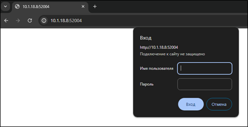

2. Перейти в компонент Index Management -> Policy managed indices:

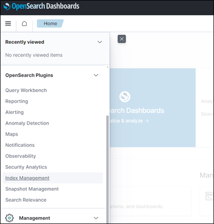

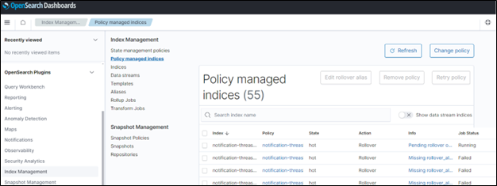

1. Для политик в статусе Failed убедиться, что сообщение в столбце info содержит текст «Missing rollover_alias index setting»:

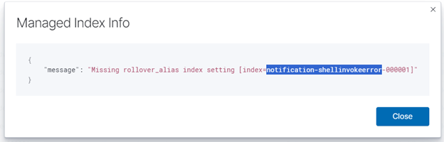

1. Для таких индексов необходимо выполнить следующие настройки:

    4.1. Выделить и скопировать в буфер обмена название индекса без числового значения, как на рисунке ниже:


    4.2. Закрыть окно сообщения.
    4.3. Выделить (установить переключатель «галочка» слева) проблемную политику и нажать кнопку «Edit rollover alias» 

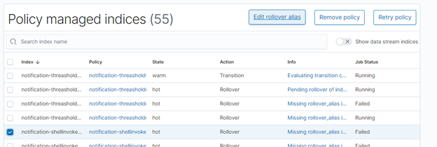

    4.4. Вставить скопированное ранее значение в поле в открывшемся окне и нажать кнопку «Edit»:

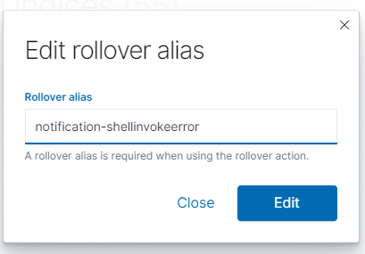

    4.5. Убедиться, что выделение с политики не снято, нажать кнопку «Retry policy»:

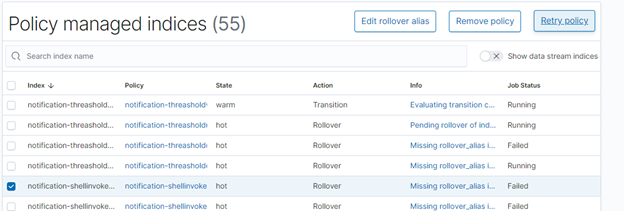

    4.6. В появившемся окне установить переключатель на значение «Retry policy from selected state» и нажать кнопку «Retry»:

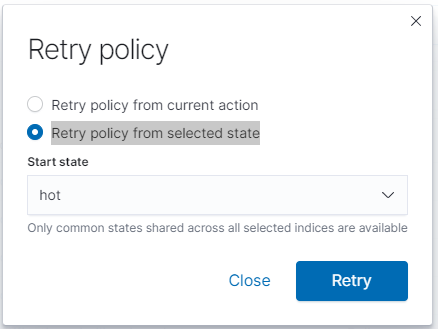


##### 4.1.10.2 Изменение срока хранения данных

Изменение политики очистки для индексов.

1.	Перейти в инструмент OpenSearch Dashboards, доступный по адресу `http://ems-ip:52004/` и авторизоваться. По умолчанию пользователь `admin`, пароль `admin`

    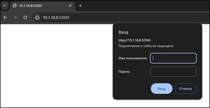


2.	Перейти в компонент Index Management -> State management policies

    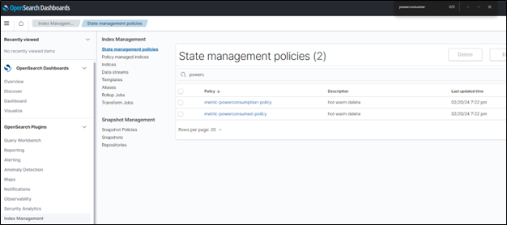


3.	Выбрать нужную политику и нажать кнопку «Edit»:

    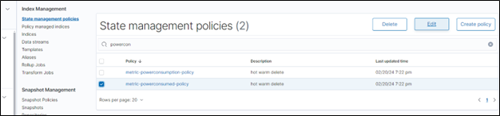


4.	В появившемся окне выбрать «JSON editor» и нажать кнопку «Continue»

    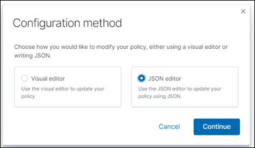


5.	В окне редактора кода найти раздел «transitions» и исправить значение параметра «min_index_age» на требуемое (в формате количества дней хранения). После чего нажать кнопку «Update»:

    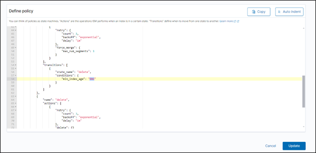


### 4.2 Мониторинг сервисов

#### 4.2.1 Мониторинг состояния системы

Корректная работа `master_cluster` и `tool_cluster` зависит от состояния `transport_cluster`, поэтому в первую очередь следует убедиться в работоспособности ноды `transport_cluster`.

##### 4.2.1.1 Мониторинг состояния `transport_cluster`

Для того, чтобы убедиться в работоспособности `transport_cluster`, необходимо подключиться к ВМ с ролью `transport` по протоколу `ssh` и выполнить:

```bash
watch docker ps -a
```

В выводе контейнеры должны быть в состоянии `Up`.

Выход из команды осуществляется нажатием сочетания клавиш `<CTRL> + C`.

*Пример рабочего вывода:*

```bash
$ watch docker ps -a
CONTAINER ID  IMAGE                                               COMMAND    CREATED        STATUS         PORTS   NAMES
...           localhost:5000/library/step-ca:0.24.2         ...        3 minutes ago  Up 3 minutes   ...     ems-acme-1
...           localhost:5000/ems/deploy/nats:2.9.18         ...        3 minutes ago  Up 3 minutes   ...     ems-leaf-nats-1
...           localhost:5000/ems/deploy/system-minio:4.2.0  ...        3 minutes ago  Up 3 minutes   ...     ems-minio-1
...           localhost:5000/ems/middle/socket-hub:3.3.0    ...        3 minutes ago  Up 3 minutes   ...     ems-socket-hub-1
...           localhost:5000/library/traefik:v2.9.8         ...        3 minutes ago  Up 3 minutes   ...     ems-traefik-1
...           registry:2                                    ...        3 minutes ago  Up 3 minutes   ...     registry
...           localhost:5000/ems/back/watchdog:4.2.0        ...        3 minutes ago  Up 3 minutes   ...     ems-watchdog-transport-1
```

##### 4.2.1.2 Мониторинг состояния `master_cluster`

Для того, чтобы убедиться в работоспособности `master_cluster`, необходимо подключиться к ВМ с ролью `master` по протоколу `ssh` и выполнить:

```bash
watch docker ps -a
```

В выводе контейнеры должны быть в состоянии `Up`.

Выход из команды осуществляется нажатием сочетания клавиш `<CTRL> + C`.

*Пример рабочего вывода:*

```bash
$ watch docker ps -a
CONTAINER ID  IMAGE                                                              COMMAND    CREATED        STATUS         PORTS   NAMES
...           localhost:5000/ems/middle/proto-gateway:4.2.0                      ...        3 minutes ago  Up 3 minutes   ...     ems-api-gw-1
...           localhost:5000/ems/back/glauth:4.2.0                               ...        3 minutes ago  Up 3 minutes   ...     ems-device-authory-center-master-1
...           localhost:5000/ems/middle/device-metric-manager:4.2.0-presenter    ...        3 minutes ago  Up 3 minutes   ...     ems-device-metric-presenter-1
...           localhost:5000/ems/middle/device-metric-manager:4.2.0-writer       ...        3 minutes ago  Up 3 minutes   ...     ems-device-metric-writer-1
...           localhost:5000/ems/middle/device-metric-manager:4.2.0-writer       ...        3 minutes ago  Up 3 minutes   ...     ems-device-metric-writer-2
...           localhost:5000/ems/middle/device-store:4.2.0                       ...        3 minutes ago  Up 3 minutes   ...     ems-device-store-1
...           localhost:5000/ems/middle/docs:4.2.0                               ...        3 minutes ago  Up 3 minutes   ...     ems-docs-1
...           localhost:5000/ems/middle/explorer:4.2.0                           ...        3 minutes ago  Up 3 minutes   ...     ems-explorer-1
...           localhost:5000/ems/deploy/nats:2.9.18                              ...        3 minutes ago  Up 3 minutes   ...     ems-kv-nats-1
...           localhost:5000/lic/license-server:1.0.9                            ...        3 minutes ago  Up 3 minutes   ...     ems-license-server-1
...           localhost:5000/ems/middle/master-network-watcher:4.2.0             ...        3 minutes ago  Up 3 minutes   ...     ems-network-watcher-1
...           localhost:5000/ems/deploy/opensearch:2.8.0-acme-1.0                ...        3 minutes ago  Up 3 minutes   ...     ems-opensearch-1
...           localhost:5000/library/opensearch-dashboards:2.6.0-openssl         ...        3 minutes ago  Up 3 minutes   ...     ems-opensearch-dashboards-1
...           localhost:5000/library/postgres:14.6-alpine3.17                    ...        3 minutes ago  Up 3 minutes   ...     ems-psql-1
...           localhost:5000/library/redis:7.0.7-alpine3.17                      ...        3 minutes ago  Up 3 minutes   ...     ems-redis-1
...           localhost:5000/ems/middle/report-scripts:4.2.0                     ...        3 minutes ago  Up 3 minutes   ...     ems-report-service-1
...           localhost:5000/ems/middle/repository-service:4.2.0                 ...        3 minutes ago  Up 3 minutes   ...     ems-repository-service-1
...           localhost:5000/ems/middle/system-metric-manager:4.2.0-presenter    ...        3 minutes ago  Up 3 minutes   ...     ems-system-metric-presenter-1
...           localhost:5000/ems/middle/system-metric-manager:4.2.0-writer       ...        3 minutes ago  Up 3 minutes   ...     ems-system-metric-writer-1
...           localhost:5000/ems/middle/system-service:4.2.0                     ...        3 minutes ago  Up 3 minutes   ...     ems-system-service-1
...           localhost:5000/ems/middle/task-service.config:4.2.0                ...        3 minutes ago  Up 3 minutes   ...     ems-task-service-1
...           localhost:5000/ems/front:4.2.0                                     ...        3 minutes ago  Up 3 minutes   ...     ems-ui-1
...           localhost:5000/ems/middle/user-service.config:4.2.0                ...        3 minutes ago  Up 3 minutes   ...     ems-user-service-1
...           localhost:5000/ems/back/watchdog:4.2.0                             ...        3 minutes ago  Up 3 minutes   ...     ems-watchdog-master-1
...           registry:2                                                         ...        3 minutes ago  Up 3 minutes   ...     registry
```

##### 4.2.1.3 Мониторинг состояния `tool_cluster`

Для того, чтобы убедиться в работоспособности `tool_cluster`, необходимо подключиться к ВМ с ролью `tool` по протоколу `ssh` и выполнить:

```bash
watch docker ps -a
```

В выводе контейнеры должны быть в состоянии `Up`.

Выход из команды осуществляется нажатием сочетания клавиш `<CTRL> + C`.

*Пример рабочего вывода:*

```bash
$ watch docker ps -a
CONTAINER ID  IMAGE                                                   COMMAND    CREATED         STATUS         PORTS   NAMES
...           localhost:5000/ems/deploy/nats:2.9.18                   ...        3 minutes ago   UP 3 minutes   ...     ems-agent-nats-1 
...           localhost:5000/ems/back/backup-handler:4.2.0            ...        3 minutes ago   UP 3 minutes   ...     ems-backup-handler-1
...           localhost:5000/ems/back/bmcbios-handler:4.2.0           ...        3 minutes ago   UP 3 minutes   ...     ems-bmcbios-handler-1
...           localhost:5000/ems/back/cacher:4.2.0                    ...        3 minutes ago   UP 3 minutes   ...     ems-cacher-1
...           localhost:5000/ems/back/cacher:4.2.0                    ...        3 minutes ago   UP 3 minutes   ...     ems-cacher-2
...           localhost:5000/ems/back/glauth:4.2.0                    ...        3 minutes ago   UP 3 minutes   ...     ems-device-authory-center-1
...           localhost:5000/ems/back/dhcp-heathchecker:4.2.0         ...        3 minutes ago   UP 3 minutes   ...     ems-dhcp-healthchecker-1
...           localhost:5000/ems/back/dispatcher:4.2.0                ...        3 minutes ago   UP 3 minutes   ...     ems-dispatcher-1
...           localhost:5000/ems/back/dispatcher:4.2.0                ...        3 minutes ago   UP 3 minutes   ...     ems-dispatcher-2
...           localhost:5000/ems/back/dispatcher:4.2.0                ...        3 minutes ago   UP 3 minutes   ...     ems-dispatcher-3
...           localhost:5000/ems/back/dispatcher:4.2.0                ...        3 minutes ago   UP 3 minutes   ...     ems-dispatcher-4
...           localhost:5000/ems/back/dispatcher:4.2.0                ...        3 minutes ago   UP 3 minutes   ...     ems-dispatcher-5
...           localhost:5000/ems/back/dispatcher:4.2.0                ...        3 minutes ago   UP 3 minutes   ...     ems-dispatcher-host-1
...           localhost:5000/ems/deploy/nats:2.9.18                   ...        3 minutes ago   UP 3 minutes   ...     ems-event-nats-1
...           localhost:5000/ems/back/fping-handler:4.2.0             ...        3 minutes ago   UP 3 minutes   ...     ems-fping-handler-1
...           localhost:5000/ems/back/fping-handler:4.2.0             ...        3 minutes ago   UP 3 minutes   ...     ems-fping-handler-2
...           localhost:5000/ems/back/hypervisor-handler:4.2.0        ...        3 minutes ago   UP 3 minutes   ...     ems-hypervisor-handler-1
...           localhost:5000/ems/back/ipmi-handler:4.2.0              ...        3 minutes ago   UP 3 minutes   ...     ems-ipmi-handler-1
...           localhost:5000/ems/back/netboot-handler:4.2.0           ...        3 minutes ago   UP 3 minutes   ...     ems-netboot-handler-1
...           localhost:5000/ems/back/os-manager-handler:4.2.0        ...        3 minutes ago   UP 3 minutes   ...     ems-os-manager-1
...           localhost:5000/ems/back/redfish-handler:4.2.0           ...        3 minutes ago   UP 3 minutes   ...     ems-redfish-handler-1
...           localhost:5000/library/redis:7.0.7-alpine3.17           ...        3 minutes ago   UP 3 minutes   ...     ems-redis-1
...           localhost:5000/ems/back/service-monitoring:4.2.0        ...        3 minutes ago   UP 3 minutes   ...     ems-service-monitoring-1
...           localhost:5000/library/sftp:5.1.5                       ...        3 minutes ago   UP 3 minutes   ...     ems-sftp-proxy-1
...           localhost:5000/library/minio:v0.3.3                     ...        3 minutes ago   UP 3 minutes   ...     ems-slave-minio-1
...           localhost:5000/ems/back/smart-handler:4.2.0             ...        3 minutes ago   UP 3 minutes   ...     ems-smart-handler-1
...           localhost:5000/ems/back/snmp-handler:4.2.0              ...        3 minutes ago   UP 3 minutes   ...     ems-snmp-handler-1
...           localhost:5000/ems/middle/socket-hub:4.2.0              ...        3 minutes ago   UP 3 minutes   ...     ems-socket-proxy-1
...           localhost:5000/ems/back/ssh-checker:4.2.0               ...        3 minutes ago   UP 3 minutes   ...     ems-ssh-checker-1
...           localhost:5000/ems/back/ssh-web-console-upgraded:4.2.0  ...        3 minutes ago   UP 3 minutes   ...     ems-ssh-web-console-1
...           localhost:5000/ems/back/syslog-getter:4.2.0             ...        3 minutes ago   UP 3 minutes   ...     ems-syslog-getter-1
...           localhost:5000/ems/back/syslog-handler:4.2.0            ...        3 minutes ago   UP 3 minutes   ...     ems-syslog-handler-1
...           localhost:5000/ems/back/watchdog:4.2.0                  ...        3 minutes ago   UP 3 minutes   ...     ems-watchdog-1
...           registry:2                                              ...        3 minutes ago   Up 3 minutes   ...     registry
```

#### 4.2.2 Мониторинг OpenSearch

Проверить доступность кластера можно выполнив команду:

```bash
curl https://{{ MASTER_HOSTNAME }}:52003 -u 'login:password'
```

> Замените {{ MASTER_HOSTNAME }} на hostname адрес ВМ `master-node`.

> По умолчанию для login:password используется пара admin:admin

> Вывод будет представлен в формате JSON и будет отражать базовые метрики кластера OpenSearch.

#### 4.2.3 Мониторинг PostgreSQL

PostgreSQL должен принимать подключения на ВМ `master_cluster`, на порту 52005.

```bash
telnet {{ MASTER_HOSTNAME }} 52003
```

> Замените {{ MASTER_HOSTNAME }} на hostname адрес ВМ `master-node`.

Проверить версию PostgreSQL можно выполнив команду в консоли psql:

```SQL
SELECT version();
```

> Версия должна быть не ниже требований.

Для просмотра состояния TLS-подключения необходимо выполнить команду в консоли psql `SELECT * FROM pg_stat_ssl;`:

```bash
postgres=# SELECT * FROM pg_stat_ssl;
```

*Пример рабочего вывода в процессе выполнения:*

```logs
pid  | ssl | version |         cipher         | bits | client_dn | client_serial | issuer_dn
-------+-----+---------+------------------------+------+-----------+---------------+-----------
35156 | t   | TLSv1.3 | TLS_AES_256_GCM_SHA384 |  256 |           |               |
(1 row)

```

#### 4.2.4. Мониторинг Minio

Проверить доступность сервиса выполнив запрос в браузере «https://<STORAGE_HOSTNAME>/minio». Ввести логин и пароль, заданные при конфигурации, и зайти на сервер.

В случае если Minio работает корректно откроется интерфейс Minio Dashboard, в котором отобразятся существующие buckets и их содержимое.

Если интерфейс недоступен, необходимо проверить состояние контейнера `minio` на ноде `transport_cluster`.

Для проверки работы Minio можно использовать клиент mc.

```bash
wget https://dl.min.io/client/mc/release/linux-amd64/mc
chmod +x mc
./mc alias set myminio/ https://<STORAGE_HOSTNAME> MYUSER MYPASSWORD
./mc admin info myminio
```

*Пример рабочего вывода в процессе выполнения:*

```bash
●  10.7.10.216:9000
Uptime: 2 hours
Version: 2022-11-08T05:27:07Z
Network: 1/1 OK
Drives: 1/1 OK
Pool: 1

Pools:
1st, Erasure sets: 1, Drives per erasure set: 1

1 drive online, 0 drives offline
```

#### 4.2.5. Сбор логов

В случае возникновения проблем, для обращения за помощью в тех. поддержку, рекомендуется собрать логи микросервисов. В комплект с ПО включены скрипты сбора логов EMS.

- `collect.ps1` - для запуска на windows
- `collect.bash` - для запуска на linux

##### 4.2.5.1 Сбор логов с помощью `Powershell`

Для запуска выполните команду из директории расположения скриптов, с параметрами подключения к сервису `opensearch`, где первый параметр - это адрес `opensearch` с логами (совпадает с адресом EMS), второй параметр - это логин для доступа к `opensearch`, третий параметр - это пароль для доступа к `opensearch`.

По умолчанию логин и пароль opensearch - `admin` `admin`

> <font color="red">**Внимание:** В случае если в ОС не разрешено выполнение скриптов выполните: `Set-ExecutionPolicy remotesigned`.</font>

>Пример:

```powershell
.\collect.ps1 10.1.18.14 admin admin
```

Будет создан архив `logs.zip`, который содержит файлы с логами EMS.
Полученный архив следует прикрепить к обращению.

##### 4.2.5.2 Сбор логов с помощью `Bash`

Для запуска перейдите в директорию где расположен скрипт и добавьте права на выполнения скрипта следующей командой:

```bash
chmod +x ./collect.sh
```

Затем выполните команду запуска скрипта с параметрами подключения к сервису `opensearch`, где первый параметр - это адрес `opensearch` с логами (совпадает с адресом EMS), второй параметр - это логин для доступа к `opensearch`, третий параметр - это пароль для доступа к `opensearch`.

По умолчанию логин и пароль opensearch - `admin` `admin`

>Пример:

```bash
.\collect.sh 10.1.18.14 admin admin
```

Будет создан архив `logs.tar.gz`, который содержит файлы с логами EMS.
Полученный архив следует прикрепить к обращению.

### 4.3 Обновление лицензий

Информация об активных лицензиях и управление ими расположены в интерфейсе Системы EMS, в разделе "Лицензии".
В меню лицензий отображен перечень и реквизиты используемых лицензий.

Более подробно ознакомиться с функционалом работы с лицензиями можно в руководстве пользователя.

> <font color="Sky Blue">**Совет:** Полномочия для управления лицензиями из интерфейса Системы EMS должны быть назначены только на роль Системного администратора.</font>

#### 4.3.1 Добавление лицензии

Для активации новой лицензии:

1. Нажмите кнопку "Импорт лицензии".
2. Укажите в проводнике путь к файлу лицензии и нажмите кнопку "Открыть". Окно проводника закроется и новая лицензия загрузится в Систему.
3. Добавленная лицензия будет отображена на экране.  

#### 4.3.2 Удаление лицензии

Для удаления старой лицензии:

1. Выберите необходимые лицензии и нажмите кнопку "Удалить".
2. Подтвердите удаление.
3. Удаленные лицензии исчезнут с экрана.  

#### 4.3.3 Восстановление работоспособности Системы при удалении всех лицензии

> <font color="red">**Внимание:** При удалении последней лицензии, система утратит работоспособность. Не удаляйте лицензию, если она является последней.</font>

> <font color="red">**Внимание:** При возникновении проблем с лицензией, система утратит работоспособность, часть контейнеров master-кластера и tool-кластера буду постоянно перезапускаться. Узнать о проблеме с лицензией можно из логов сервиса license-server на master-кластере.</font>

Для восстановления работоспособности Системы EMS:

1. Через консоль разместить файл актуальной лицензии в `master_cluster` в каталоге /opt/ems/config/lics.

2. Спустя некоторое время Система автоматически найдет файл лицензии и активирует его.

#### 4.3.4 Восстановление работоспособности Системы при изменении client_name в лицензии(EMS в режиме одной ноды)

Для восстановления работоспособности Системы EMS:

1. Остановить EMS, для этого:

На ноде single выполнить:

```bash
docker stop $(docker ps -aq)
```

После чего выполнить:

```bash
docker rm -f ems-leaf-nats-1
docker volume rm ems_leaf-nats
```

2. Через консоль разместить файл актуальной лицензии в каталоге /opt/ems/master/config/license.json. **Старые файлы лицнзий необходимо удалить.**
3. Открыть предпочитаемым редактором файл настроек EMS, расположенный в `/opt/ems/master/.env` и отредактировать значение переменной CLIENT_NAME.
4. Выполнить запуск проекта EMS.

На ноде single выполнить:

```bash
/opt/ems/emsinstaller --mode install-only
```

### 4.4 Диагностика проблем

#### 4.4.1 Диагностика проблем Docker

Список часто используемых команд для диагностики состояния Docker:

1. Проверить состояние контейнеров можно выполнив команду:

```bash
docker ps -a
```

> <font color="red">**Внимание:** Из вывода команды требуются поля `CONTAINER_ID` и `CONTAINER_NAME`, для использования в прочих командах диагностики.</font>

2. Посмотреть логи контейнера можно выполнив команду:

```bash
docker logs <CONTAINER_ID>
```

> <font color="red">**Внимание:** В выводе может содержаться информация, которая поможет в решении возникшей проблемы.</font>

3. Посмотреть свойства контейнера можно выполнив команду:

```bash
docker inspect <CONTAINER_ID>
```

> <font color="red">**Внимание:** Требуется ознакомиться с выводом и убедиться, что все переменные окружения, порты и volumes корректно настроены.</font>

4. Остановить контейнер можно выполнив команду:

```bash
docker stop <CONTAINER_ID>
```

5. Запустить контейнер можно выполнив команду:

```bash
docker start <CONTAINER_ID>
```

6. Перезапустить контейнер можно выполнив команду:

```bash
docker restart <CONTAINER_ID>
```

#### 4.4.2 Анализ аварийных ситуаций

В случае возникновения аварийных ситуаций, для их расследования, необходимо воспользоваться следующими инструментами:

1. Для выявления проблемных сервисов, необходимо воспользоваться функцией Системы - разделом интерфейса "Карта кластера". На вкладке "Карта кластера" показаны общий статус состояния кластера и состояния каждого сервиса кластера системы.

2. Для подтверждения проблем, можно воспользоваться функцией "Журнал событий" в карточке нужного устройства.

3. В случае критичных ошибок, Система выдает уведомления пользователю.

4. В случае наличия проблем и отсутствия возможности их идентификации с помощью пунктов 1-3 текущего раздела, необходимо обратиться в службу поддержки.

Подробнее с описанным выше функционалом можно ознакомиться в руководстве пользователя.

### 4.5 Восстановление системы из бекапа (watchdog)

При включенной функции бэкапирования, в удаленном NFS хранилище будут сохранены снапшоты состояния системы. При возникновении проблем можно восстановить состояние EMS из снапшота.

#### 4.5.1 Восстановление системы из бекапа для однонодовой версии EMS

Восстановление EMS осуществляется в несколько этапов.

**Этап 1. Необходимо выполнить полную остановку EMS**

1. Подключиться к ноде single:

Подключитесь к `single-node` с помощью SSH-клиента:

> Замените {{ SINGLE_NODE_IP }} на IP адрес ВМ `single_node`:

```bash
ssh root@{{ SINGLE_NODE_IP }}
```

2. Остановить EMS:

```bash
docker stop $(docker ps -aq)
```

**Этап 2. Восстановление EMS из бэкапа**

1. Подключиться к ноде single:

Подключитесь к `single-node` с помощью SSH-клиента:

> Замените {{ SINGLE_NODE_IP }} на IP адрес ВМ `single_node`:

```bash
ssh root@{{ SINGLE_NODE_IP }}
```

2. Cкопировать бэкап на ноду и распаковать архив:

> <font color="red">**Внимание:**  Вместо `< date >` необходимо указать требуемую дату.</font>

> <font color="red">**Внимание:**  имя архива может отличаться от указанного в команде ниже.</font>

```bash
mkdir -p /opt/ems/restore
cp /nfs/backup_< date >/* /opt/ems/restore
cd /opt/ems/restore
tar xzf backup_tool.tar.gz -C /opt/ems/restore

```

3. Восстановить состояние EMS:

```bash
docker run --rm -it -v /opt/ems/bin/restic:/bin/restic \
          -v /opt/ems/config/pwd:/opt/pwd \
          -v /opt/ems/restore/tmp/:/tmp \
          -v ems_minio:/backup/minio \
          -v ems_event-nats:/backup/event-nats \
          -v ems_agent-nats:/backup/agent-nats \
          -v /opt/ems/config:/backup/config \
          alpine restic restore latest -r /tmp/backup -p /opt/pwd --target /backup
```

5. Cкопировать бэкап на ноду и распаковать архив:

> <font color="red">**Внимание:**  Вместо `< date >` необходимо указать требуемую дату.</font>

> <font color="red">**Внимание:**  имя архива может отличаться от указанного в команде ниже.</font>

```bash
mkdir -p /opt/ems/restore
cp /nfs/backup_< date >/* /opt/ems/restore
cd /opt/ems/restore
tar xzf backup_master.tar.gz -C /opt/ems/restore

```

7. Восстановить состояние EMS:

```bash
docker run --rm -it -v /opt/ems/bin/restic:/bin/restic \
          -v /opt/ems/config/pwd:/opt/pwd \
          -v /opt/ems/restore/tmp/:/tmp \
          -v ems_opensearch:/backup/opensearch \
          -v ems_kv:/backup/kv \
          -v ems_psql:/backup/psql \
          -v /opt/ems/config:/backup/config \
          alpine restic restore latest -r /tmp/backup -p /opt/pwd --target /backup
```

9. Cкопировать бэкап на ноду и распаковать архив:

> <font color="red">**Внимание:**  Вместо `< date >` необходимо указать требуемую дату.</font>

> <font color="red">**Внимание:**  имя архива может отличаться от указанного в команде ниже.</font>

```bash
mkdir -p /opt/ems/restore
cp /nfs/backup_< date >/* /opt/ems/restore
cd /opt/ems/restore
tar xzf backup_transport.tar.gz -C /opt/ems/restore

```

10. Восстановить состояние EMS:

```bash
docker run --rm -it -v /opt/ems/bin/restic:/bin/restic \
          -v /opt/ems/config/pwd:/opt/pwd \
          -v /opt/ems/restore/tmp/:/tmp \
          -v ems_minio:/backup/minio \
          -v ems_leaf-nats:/backup/leaf-nats \
          -v /opt/ems/config:/backup/config \
          alpine restic restore latest -r /tmp/backup -p /opt/pwd --target /backup
```

**Этап 3. Выполнить запуск EMS**

1. Подключиться к ноде single:

Подключитесь к `single-node` с помощью SSH-клиента:

> Замените {{ SINGLE_NODE_IP }} на IP адрес ВМ `single_node`:

```bash
ssh root@{{ SINGLE_NODE_IP }}
```

2. Запустить EMS:

```bash
docker start $(docker ps -aq)
```

#### 4.5.2 Восстановление системы из бекапа для мультинодовой версии EMS

Восстановление EMS осуществляется в несколько этапов.

**Этап 1. Необходимо выполнить полную остановку EMS**

Необходимо полностью отановить систему. Для этого необходимо выполнить следующие действия, указанные в документе [Руководство по инсталляции EMS в режиме HA на 3 дата-центра](./HA_install/EMS_installation_guide_HA.md#остановка-системы).

**Этап 2. Восстановление EMS из бэкапа**

1. Подключиться к ноде swarm-node-1:

Подключитесь к `swarm-node-1` с помощью SSH-клиента:

> Замените {{ SWARM_NODE_1_IP }} на IP адрес ВМ `swarm-node-1`:

```bash
ssh root@{{ SWARM_NODE_1_IP }}
```

2. Cкопировать бэкап на ноду и распаковать архив:

> <font color="red">**Внимание:**  Вместо `< date >` необходимо указать требуемую дату.</font>

> <font color="red">**Внимание:**  имя архива может отличаться от указанного в команде ниже.</font>

```bash
mkdir -p /opt/ems/restore/node_1_master
cp /nfs/backup_< date >/backup_master_swarm-node-1.tar.gz /opt/ems/restore/node_1_master
cd /opt/ems/restore/node_1_master
tar xzf backup_master_swarm-node-1.tar.gz -C /opt/ems/restore/node_1_master

```

3. Восстановить состояние EMS:

```bash
docker run --rm -it -v /opt/ems/bin/restic:/bin/restic \
          -v /opt/ems/config/pwd:/opt/pwd \
          -v /opt/ems/restore/node_1_master/tmp/:/tmp \
          -v etcd-1:/backup/etcd-1 \
          -v etcd-2:/backup/etcd-2 \
          -v etcd-3:/backup/etcd-3 \
          -v etcd-4:/backup/etcd-4 \
          -v etcd-5:/backup/etcd-5 \
          -v kv-1:/backup/kv-1 \
          -v kv-2:/backup/kv-2 \
          -v kv-3:/backup/kv-3 \
          -v kv-4:/backup/kv-4 \
          -v kv-5:/backup/kv-5 \
          -v logs:/backup/logs \
          -v opensearch-1:/backup/opensearch-1 \
          -v opensearch-2:/backup/opensearch-2 \
          -v opensearch-3:/backup/opensearch-3 \
          -v opensearch-4:/backup/opensearch-4 \
          -v opensearch-5:/backup/opensearch-5 \
          -v patroni-1:/backup/patroni-1 \
          -v patroni-2:/backup/patroni-2 \
          -v patroni-3:/backup/patroni-3 \
          -v patroni-4:/backup/patroni-4 \
          -v patroni-5:/backup/patroni-5 \
          -v /opt/ems/config:/backup/config \
          alpine restic restore latest -r /tmp/backup -p /opt/pwd --target /backup
```

4. Cкопировать бэкап на ноду и распаковать архив:

> <font color="red">**Внимание:**  Вместо `< date >` необходимо указать требуемую дату.</font>

> <font color="red">**Внимание:**  имя архива может отличаться от указанного в команде ниже.</font>

```bash
mkdir -p /opt/ems/restore/node_1_transport
cp /nfs/backup_< date >/backup_transport_swarm-node-1.tar.gz /opt/ems/restore/node_1_transport
cd /opt/ems/restore/node_1_transport
tar xzf backup_transport_swarm-node-1.tar.gz -C /opt/ems/restore/node_1_transport

```

5. Восстановить состояние EMS:

```bash
docker run --rm -it -v /opt/ems/bin/restic:/bin/restic \
          -v /opt/ems/config/pwd:/opt/pwd \
          -v /opt/ems/restore/node_1_transport/tmp/:/tmp \
          -v block-1:/backup/block-1 \
          -v block-2:/backup/block-2 \
          -v block-3:/backup/block-3 \
          -v block-4:/backup/block-4 \
          -v block-5:/backup/block-5 \
          -v block-6:/backup/block-6 \
          -v leaf-nats-1:/backup/leaf-nats-1 \
          -v leaf-nats-2:/backup/leaf-nats-2 \
          -v leaf-nats-3:/backup/leaf-nats-3 \
          -v leaf-nats-4:/backup/leaf-nats-4 \
          -v leaf-nats-5:/backup/leaf-nats-5 \
          -v /opt/ems/config:/backup/config \
          alpine restic restore latest -r /tmp/backup -p /opt/pwd --target /backup
  ```

6. Cкопировать бэкап на ноду и распаковать архив:

> <font color="red">**Внимание:**  Вместо `< date >` необходимо указать требуемую дату.</font>

> <font color="red">**Внимание:**  имя архива может отличаться от указанного в команде ниже.</font>

```bash
mkdir -p /opt/ems/restore/node_1_tool
cp /nfs/backup_< date >/backup_tool_swarm-node-1.tar.gz /opt/ems/restore/node_1_tool
cd /opt/ems/restore/node_1_tool
tar xzf backup_tool_swarm-node-1.tar.gz -C /opt/ems/restore/node_1_tool

```

7. Восстановить состояние EMS:

```bash
docker run --rm -it -v /opt/ems/bin/restic:/bin/restic \
          -v /opt/ems/config/pwd:/opt/pwd \
          -v /opt/ems/restore/node_1_tool/tmp/:/tmp \
          -v agent-nats:/backup/agent-nats \
          -v event-nats:/backup/event-nats \
          -v minio:/backup/minio \
          -v /opt/ems/config:/backup/config \
          alpine restic restore latest -r /tmp/backup -p /opt/pwd --target /backup
```

8. Подключиться к ноде swarm-node-2:

Подключитесь к `swarm-node-2` с помощью SSH-клиента:

> Замените {{ SWARM_NODE_2_IP }} на IP адрес ВМ `swarm-node-2`:

```bash
ssh root@{{ SWARM_NODE_2_IP }}
```

9. Cкопировать бэкап на ноду и распаковать архив:

> <font color="red">**Внимание:**  Вместо `< date >` необходимо указать требуемую дату.</font>

> <font color="red">**Внимание:**  имя архива может отличаться от указанного в команде ниже.</font>

```bash
mkdir -p /opt/ems/restore/node_2_master
cp /nfs/backup_< date >/backup_master_swarm-node-2.tar.gz /opt/ems/restore/node_2_master
cd /opt/ems/restore/node_2_master
tar xzf backup_master_swarm-node-2.tar.gz -C /opt/ems/restore/node_2_master

```

10. Восстановить состояние EMS:

```bash
docker run --rm -it -v /opt/ems/bin/restic:/bin/restic \
          -v /opt/ems/config/pwd:/opt/pwd \
          -v /opt/ems/restore/node_2_master/tmp/:/tmp \
          -v etcd-1:/backup/etcd-1 \
          -v etcd-2:/backup/etcd-2 \
          -v etcd-3:/backup/etcd-3 \
          -v etcd-4:/backup/etcd-4 \
          -v etcd-5:/backup/etcd-5 \
          -v kv-1:/backup/kv-1 \
          -v kv-2:/backup/kv-2 \
          -v kv-3:/backup/kv-3 \
          -v kv-4:/backup/kv-4 \
          -v kv-5:/backup/kv-5 \
          -v logs:/backup/logs \
          -v opensearch-1:/backup/opensearch-1 \
          -v opensearch-2:/backup/opensearch-2 \
          -v opensearch-3:/backup/opensearch-3 \
          -v opensearch-4:/backup/opensearch-4 \
          -v opensearch-5:/backup/opensearch-5 \
          -v patroni-1:/backup/patroni-1 \
          -v patroni-2:/backup/patroni-2 \
          -v patroni-3:/backup/patroni-3 \
          -v patroni-4:/backup/patroni-4 \
          -v patroni-5:/backup/patroni-5 \
          -v /opt/ems/config:/backup/config \
          alpine restic restore latest -r /tmp/backup -p /opt/pwd --target /backup
```

11. Cкопировать бэкап на ноду и распаковать архив:

> <font color="red">**Внимание:**  Вместо `< date >` необходимо указать требуемую дату.</font>

> <font color="red">**Внимание:**  имя архива может отличаться от указанного в команде ниже.</font>

```bash
mkdir -p /opt/ems/restore/node_2_transport
cp /nfs/backup_< date >/backup_transport_swarm-node-2.tar.gz /opt/ems/restore/node_2_transport
cd /opt/ems/restore/node_2_transport
tar xzf backup_transport_swarm-node-2.tar.gz -C /opt/ems/restore/node_2_transport

```

12. Восстановить состояние EMS:

```bash
docker run --rm -it -v /opt/ems/bin/restic:/bin/restic \
          -v /opt/ems/config/pwd:/opt/pwd \
          -v /opt/ems/restore/node_2_transport/tmp/:/tmp \
          -v block-1:/backup/block-1 \
          -v block-2:/backup/block-2 \
          -v block-3:/backup/block-3 \
          -v block-4:/backup/block-4 \
          -v block-5:/backup/block-5 \
          -v block-6:/backup/block-6 \
          -v leaf-nats-1:/backup/leaf-nats-1 \
          -v leaf-nats-2:/backup/leaf-nats-2 \
          -v leaf-nats-3:/backup/leaf-nats-3 \
          -v leaf-nats-4:/backup/leaf-nats-4 \
          -v leaf-nats-5:/backup/leaf-nats-5 \
          -v /opt/ems/config:/backup/config \
          alpine restic restore latest -r /tmp/backup -p /opt/pwd --target /backup
```

13. Подключиться к ноде swarm-node-3:

Подключитесь к `swarm-node-3` с помощью SSH-клиента:

> Замените {{ SWARM_NODE_3_IP }} на IP адрес ВМ `swarm-node-3`:

```bash
ssh root@{{ SWARM_NODE_3_IP }}
```

14. Cкопировать бэкап на ноду и распаковать архив:

> <font color="red">**Внимание:**  Вместо `< date >` необходимо указать требуемую дату.</font>

> <font color="red">**Внимание:**  имя архива может отличаться от указанного в команде ниже.</font>

```bash
mkdir -p /opt/ems/restore/node_3_master
cp /nfs/backup_< date >/backup_master_swarm-node-3.tar.gz /opt/ems/restore/node_3_master
cd /opt/ems/restore/node_3_master
tar xzf backup_master_swarm-node-3.tar.gz -C /opt/ems/restore/node_3_master

```

15. Восстановить состояние EMS:

```bash
docker run --rm -it -v /opt/ems/bin/restic:/bin/restic \
          -v /opt/ems/config/pwd:/opt/pwd \
          -v /opt/ems/restore/node_3_master/tmp/:/tmp \
          -v etcd-1:/backup/etcd-1 \
          -v etcd-2:/backup/etcd-2 \
          -v etcd-3:/backup/etcd-3 \
          -v etcd-4:/backup/etcd-4 \
          -v etcd-5:/backup/etcd-5 \
          -v kv-1:/backup/kv-1 \
          -v kv-2:/backup/kv-2 \
          -v kv-3:/backup/kv-3 \
          -v kv-4:/backup/kv-4 \
          -v kv-5:/backup/kv-5 \
          -v logs:/backup/logs \
          -v opensearch-1:/backup/opensearch-1 \
          -v opensearch-2:/backup/opensearch-2 \
          -v opensearch-3:/backup/opensearch-3 \
          -v opensearch-4:/backup/opensearch-4 \
          -v opensearch-5:/backup/opensearch-5 \
          -v patroni-1:/backup/patroni-1 \
          -v patroni-2:/backup/patroni-2 \
          -v patroni-3:/backup/patroni-3 \
          -v patroni-4:/backup/patroni-4 \
          -v patroni-5:/backup/patroni-5 \
          -v /opt/ems/config:/backup/config \
          alpine restic restore latest -r /tmp/backup -p /opt/pwd --target /backup
```

16. Cкопировать бэкап на ноду и распаковать архив:

> <font color="red">**Внимание:**  Вместо `< date >` необходимо указать требуемую дату.</font>

> <font color="red">**Внимание:**  имя архива может отличаться от указанного в команде ниже.</font>

```bash
mkdir -p /opt/ems/restore/node_3_transport
cp /nfs/backup_< date >/backup_transport_swarm-node-3.tar.gz /opt/ems/restore/node_3_transport
cd /opt/ems/restore/node_3_transport
tar xzf backup_transport_swarm-node-3.tar.gz -C /opt/ems/restore/node_3_transport

```

17. Восстановить состояние EMS:

```bash
docker run --rm -it -v /opt/ems/bin/restic:/bin/restic \
          -v /opt/ems/config/pwd:/opt/pwd \
          -v /opt/ems/restore/node_3_transport/tmp/:/tmp \
          -v block-1:/backup/block-1 \
          -v block-2:/backup/block-2 \
          -v block-3:/backup/block-3 \
          -v block-4:/backup/block-4 \
          -v block-5:/backup/block-5 \
          -v block-6:/backup/block-6 \
          -v leaf-nats-1:/backup/leaf-nats-1 \
          -v leaf-nats-2:/backup/leaf-nats-2 \
          -v leaf-nats-3:/backup/leaf-nats-3 \
          -v leaf-nats-4:/backup/leaf-nats-4 \
          -v leaf-nats-5:/backup/leaf-nats-5 \
          -v /opt/ems/config:/backup/config \
          alpine restic restore latest -r /tmp/backup -p /opt/pwd --target /backup
```

18. Подключиться к ноде swarm-node-4:

Подключитесь к `swarm-node-4` с помощью SSH-клиента:

> Замените {{ SWARM_NODE_4_IP }} на IP адрес ВМ `swarm-node-4`:

```bash
ssh root@{{ SWARM_NODE_4_IP }}
```


19. Cкопировать бэкап на ноду и распаковать архив:

> <font color="red">**Внимание:**  Вместо `< date >` необходимо указать требуемую дату.</font>

> <font color="red">**Внимание:**  имя архива может отличаться от указанного в команде ниже.</font>

```bash
mkdir -p /opt/ems/restore/node_4_master
cp /nfs/backup_< date >/backup_master_swarm-node-4.tar.gz /opt/ems/restore/node_4_master
cd /opt/ems/restore/node_4_master
tar xzf backup_master_swarm-node-4.tar.gz -C /opt/ems/restore/node_4_master

```

20. Восстановить состояние EMS:

```bash
docker run --rm -it -v /opt/ems/bin/restic:/bin/restic \
          -v /opt/ems/config/pwd:/opt/pwd \
          -v /opt/ems/restore/node_4_master/tmp/:/tmp \
          -v etcd-1:/backup/etcd-1 \
          -v etcd-2:/backup/etcd-2 \
          -v etcd-3:/backup/etcd-3 \
          -v etcd-4:/backup/etcd-4 \
          -v etcd-5:/backup/etcd-5 \
          -v kv-1:/backup/kv-1 \
          -v kv-2:/backup/kv-2 \
          -v kv-3:/backup/kv-3 \
          -v kv-4:/backup/kv-4 \
          -v kv-5:/backup/kv-5 \
          -v logs:/backup/logs \
          -v opensearch-1:/backup/opensearch-1 \
          -v opensearch-2:/backup/opensearch-2 \
          -v opensearch-3:/backup/opensearch-3 \
          -v opensearch-4:/backup/opensearch-4 \
          -v opensearch-5:/backup/opensearch-5 \
          -v patroni-1:/backup/patroni-1 \
          -v patroni-2:/backup/patroni-2 \
          -v patroni-3:/backup/patroni-3 \
          -v patroni-4:/backup/patroni-4 \
          -v patroni-5:/backup/patroni-5 \
          -v /opt/ems/config:/backup/config \
          alpine restic restore latest -r /tmp/backup -p /opt/pwd --target /backup
```

21. Cкопировать бэкап на ноду и распаковать архив:

> <font color="red">**Внимание:**  Вместо `< date >` необходимо указать требуемую дату.</font>

> <font color="red">**Внимание:**  имя архива может отличаться от указанного в команде ниже.</font>

```bash
mkdir -p /opt/ems/restore/node_4_transport
cp /nfs/backup_< date >/backup_transport_swarm-node-4.tar.gz /opt/ems/restore/node_4_transport
cd /opt/ems/restore/node_4_transport
tar xzf backup_transport_swarm-node-4.tar.gz -C /opt/ems/restore/node_4_transport

```

22. Восстановить состояние EMS:

```bash
docker run --rm -it -v /opt/ems/bin/restic:/bin/restic \
          -v /opt/ems/config/pwd:/opt/pwd \
          -v /opt/ems/restore/node_4_transport/tmp/:/tmp \
          -v block-1:/backup/block-1 \
          -v block-2:/backup/block-2 \
          -v block-3:/backup/block-3 \
          -v block-4:/backup/block-4 \
          -v block-5:/backup/block-5 \
          -v block-6:/backup/block-6 \
          -v leaf-nats-1:/backup/leaf-nats-1 \
          -v leaf-nats-2:/backup/leaf-nats-2 \
          -v leaf-nats-3:/backup/leaf-nats-3 \
          -v leaf-nats-4:/backup/leaf-nats-4 \
          -v leaf-nats-5:/backup/leaf-nats-5 \
          -v /opt/ems/config:/backup/config \
          alpine restic restore latest -r /tmp/backup -p /opt/pwd --target /backup
```

23. Подключиться к ноде swarm-minio-1:

Подключитесь к `swarm-minio-1` с помощью SSH-клиента:

> Замените {{ SWARM_MINIO_1_IP }} на IP адрес ВМ `swarm-minio-1`:

```bash
ssh root@{{ SWARM_MINIO_1_IP }}
```


24. Cкопировать бэкап на ноду и распаковать архив:

> <font color="red">**Внимание:**  Вместо `< date >` необходимо указать требуемую дату.</font>

> <font color="red">**Внимание:**  имя архива может отличаться от указанного в команде ниже.</font>

```bash
mkdir -p /opt/ems/restore/minio_1_master
cp /nfs/backup_< date >/backup_master_swarm-minio-1.tar.gz /opt/ems/restore/minio_1_master
cd /opt/ems/restore/minio_1_master
tar xzf backup_master_swarm-minio-1.tar.gz -C /opt/ems/restore/minio_1_master

```

25. Восстановить состояние EMS:

```bash
docker run --rm -it -v /opt/ems/bin/restic:/bin/restic \
          -v /opt/ems/config/pwd:/opt/pwd \
          -v /opt/ems/restore/minio_1_master/tmp/:/tmp \
          -v etcd-1:/backup/etcd-1 \
          -v etcd-2:/backup/etcd-2 \
          -v etcd-3:/backup/etcd-3 \
          -v etcd-4:/backup/etcd-4 \
          -v etcd-5:/backup/etcd-5 \
          -v kv-1:/backup/kv-1 \
          -v kv-2:/backup/kv-2 \
          -v kv-3:/backup/kv-3 \
          -v kv-4:/backup/kv-4 \
          -v kv-5:/backup/kv-5 \
          -v logs:/backup/logs \
          -v opensearch-1:/backup/opensearch-1 \
          -v opensearch-2:/backup/opensearch-2 \
          -v opensearch-3:/backup/opensearch-3 \
          -v opensearch-4:/backup/opensearch-4 \
          -v opensearch-5:/backup/opensearch-5 \
          -v patroni-1:/backup/patroni-1 \
          -v patroni-2:/backup/patroni-2 \
          -v patroni-3:/backup/patroni-3 \
          -v patroni-4:/backup/patroni-4 \
          -v patroni-5:/backup/patroni-5 \
          -v /opt/ems/config:/backup/config \
          alpine restic restore latest -r /tmp/backup -p /opt/pwd --target /backup
```

26. Cкопировать бэкап на ноду и распаковать архив:

> <font color="red">**Внимание:**  Вместо `< date >` необходимо указать требуемую дату.</font>

> <font color="red">**Внимание:**  имя архива может отличаться от указанного в команде ниже.</font>

```bash
mkdir -p /opt/ems/restore/minio_1_transport
cp /nfs/backup_< date >/backup_transport_swarm-minio-1.tar.gz /opt/ems/restore/minio_1_transport
cd /opt/ems/restore/minio_1_transport
tar xzf backup_transport_swarm-minio-1.tar.gz -C /opt/ems/restore/minio_1_transport

```

27. Восстановить состояние EMS:

```bash
docker run --rm -it -v /opt/ems/bin/restic:/bin/restic \
          -v /opt/ems/config/pwd:/opt/pwd \
          -v /opt/ems/restore/minio_1_transport/tmp/:/tmp \
          -v block-1:/backup/block-1 \
          -v block-2:/backup/block-2 \
          -v block-3:/backup/block-3 \
          -v block-4:/backup/block-4 \
          -v block-5:/backup/block-5 \
          -v block-6:/backup/block-6 \
          -v leaf-nats-1:/backup/leaf-nats-1 \
          -v leaf-nats-2:/backup/leaf-nats-2 \
          -v leaf-nats-3:/backup/leaf-nats-3 \
          -v leaf-nats-4:/backup/leaf-nats-4 \
          -v leaf-nats-5:/backup/leaf-nats-5 \
          -v /opt/ems/config:/backup/config \
          alpine restic restore latest -r /tmp/backup -p /opt/pwd --target /backup
```

28. Подключиться к ноде swarm-minio-2:

Подключитесь к `swarm-minio-2` с помощью SSH-клиента:

> Замените {{ SWARM_MINIO_2_IP }} на IP адрес ВМ `swarm-minio-2`:

```bash
ssh root@{{ SWARM_MINIO_2_IP }}
```

29. Cкопировать бэкап на ноду и распаковать архив:

> <font color="red">**Внимание:**  Вместо `< date >` необходимо указать требуемую дату.</font>

> <font color="red">**Внимание:**  имя архива может отличаться от указанного в команде ниже.</font>

```bash
mkdir -p /opt/ems/restore/minio_2_master
cp /nfs/backup_< date >/backup_master_swarm-minio-2.tar.gz /opt/ems/restore/minio_2_master
cd /opt/ems/restore/minio_2_master
tar xzf backup_master_swarm-minio-2.tar.gz -C /opt/ems/restore/minio_2_master
```

30. Восстановить состояние EMS:

```bash
docker run --rm -it -v /opt/ems/bin/restic:/bin/restic \
          -v /opt/ems/config/pwd:/opt/pwd \
          -v /opt/ems/restore/minio_2_master/tmp/:/tmp \
          -v etcd-1:/backup/etcd-1 \
          -v etcd-2:/backup/etcd-2 \
          -v etcd-3:/backup/etcd-3 \
          -v etcd-4:/backup/etcd-4 \
          -v etcd-5:/backup/etcd-5 \
          -v kv-1:/backup/kv-1 \
          -v kv-2:/backup/kv-2 \
          -v kv-3:/backup/kv-3 \
          -v kv-4:/backup/kv-4 \
          -v kv-5:/backup/kv-5 \
          -v logs:/backup/logs \
          -v opensearch-1:/backup/opensearch-1 \
          -v opensearch-2:/backup/opensearch-2 \
          -v opensearch-3:/backup/opensearch-3 \
          -v opensearch-4:/backup/opensearch-4 \
          -v opensearch-5:/backup/opensearch-5 \
          -v patroni-1:/backup/patroni-1 \
          -v patroni-2:/backup/patroni-2 \
          -v patroni-3:/backup/patroni-3 \
          -v patroni-4:/backup/patroni-4 \
          -v patroni-5:/backup/patroni-5 \
          -v /opt/ems/config:/backup/config \
          alpine restic restore latest -r /tmp/backup -p /opt/pwd --target /backup
```

31. Cкопировать бэкап на ноду и распаковать архив:

> <font color="red">**Внимание:**  Вместо `< date >` необходимо указать требуемую дату.</font>

> <font color="red">**Внимание:**  имя архива может отличаться от указанного в команде ниже.</font>

```bash
mkdir -p /opt/ems/restore/minio_2_transport
cp /nfs/backup_< date >/backup_transport_swarm-minio-2.tar.gz /opt/ems/restore/minio_2_transport
cd /opt/ems/restore/minio_2_transport
tar xzf backup_transport_swarm-minio-2.tar.gz -C /opt/ems/restore/minio_2_transport
```

32. Восстановить состояние EMS:

```bash
docker run --rm -it -v /opt/ems/bin/restic:/bin/restic \
          -v /opt/ems/config/pwd:/opt/pwd \
          -v /opt/ems/restore/minio_2_transport/tmp/:/tmp \
          -v block-1:/backup/block-1 \
          -v block-2:/backup/block-2 \
          -v block-3:/backup/block-3 \
          -v block-4:/backup/block-4 \
          -v block-5:/backup/block-5 \
          -v block-6:/backup/block-6 \
          -v leaf-nats-1:/backup/leaf-nats-1 \
          -v leaf-nats-2:/backup/leaf-nats-2 \
          -v leaf-nats-3:/backup/leaf-nats-3 \
          -v leaf-nats-4:/backup/leaf-nats-4 \
          -v leaf-nats-5:/backup/leaf-nats-5 \
          -v /opt/ems/config:/backup/config \
          alpine restic restore latest -r /tmp/backup -p /opt/pwd --target /backup
```

**Этап 3. Выполнить запуск EMS**

Для выполнения запуска EMS, необходимо выполнить следующие действия, указанные в документе [Руководство по инсталляции EMS в режиме HA на 3 дата-центра](./HA_install/EMS_installation_guide_HA.md#запуск-системы-после-остановки).

### 4.6 Решение проблемы с запуском Системы EMS в Astra Linux

В некоторых ситуациях возможно возникновение проблемы с запуском Системы EMS в ОС
Astra Linux сразу после установки.

Симптомы:

- Большая часть контейнеров кластера `master` и `tool` постоянно перезапускаются
- В логах контейнера `ems-api-gw-1` на `master` кластере можно обнаружить ошибку
`SocketException (13): Permission denied`

Решение:

Для следующих сервисов необходимо исправить определение в файле `compose.yaml`

- `tool` кластер
  - backup-handler
  - os-manager
  - fping-handler
  - netboot-handler
  - redfish-handler
  - device-authory-center
  - ssh-checker
  - wmi-handler
  - snmp-handler
  - dhcp-healthchecker
  - ipmi-handler
  - hypervisor-handler
  - syslog-handler
  - smart-handler
  - bmcbios-handler
  - cacher
  - service-monitoring
- `master` кластер
  - api-gw
  - device-metric-writer
  - system-metric-writer
  - device-metric-writer-2
  - opensearch-dashboards
  - task-service
  - device-store
  - explorer
  - device-metric-presenter
  - license-server
  - report-service
  - user-service
  - redis
  - device-authory-center-master
  - opensearch
  - kv-nats
  - system-metric-presenter
  - docs
  - repository-service
  - system-service
  - ui
  - watchdog-master
  - ems-network-watcher
  - ems-psql
- `transport` кластер
  - socket-hub

Необходимо на перечисленных кластерах отредактировать файл `/opt/ems/{CLUSTER_NAME}/compose/compose.yaml`. Для этого необходимо:

1. Выполнить остановку Системы EMS командой:

```bash
/opt/ems/{CLUSTER_NAME}/bin/docker-compose --env-file /opt/ems/{CLUSTER_NAME}/compose/compose.env -f /opt/ems/{CLUSTER_NAME}/compose/compose.yaml down
```

2. Добавить к перечисленным сервисам настройку `user: "0:0"`, как показано ниже
(для примера приведена только часть конфигурации):

```yaml
services:
  api-gw:
    <<: *common
    user: "0:0"
    image: ${API_GW_DOCKER_IMAGE}
```

3. После того, как файл отредактирован необходимо выполнить перезапуск Системы
EMS, выполнив команду:

```bash
/opt/ems/{CLUSTER_NAME}/bin/docker-compose --env-file /opt/ems/{CLUSTER_NAME}/compose/compose.env -f /opt/ems/{CLUSTER_NAME}/compose/compose.yaml up -d
```

## 5 Техническая поддержка

При возникновении вопросов администрирования Системы обратитесь в техническую поддержку.  
Техническая поддержка осуществляется в стандартные рабочие дни с 09:00 до 18:00 по московскому времени:

- Обращения через электронную почту `sd@bergen.tech`
- Телефоны: +7 (925) 007-38-52; +7 (495) 664-37-83.

## Приложения

### Перечень ссылочных документов

- Руководство пользователя EMS v4.2.0;
- Руководство администратора Системы EMS v4.2.0;
- Руководство по инсталляции Системы EMS v4.2.0 в режиме одной ноды;
- Руководство по обновлению Системы EMS с версии 3.5.3 до версии 4.2.0 в режиме одной ноды;  
- Программа и методика испытаний системы EMS v4.2.0.

### Справочная информация

#### Команды Linux

Список часто используемых команд Linux:

1. Проверить наличие свободного дискового пространства можно выполнив команду:

```bash
df -h
```

2. Проверить загруженность CPU можно выполнив команду:

```bash
top
```

Либо

```bash
htop
```

3. Проверить загруженность RAM можно выполнив команду:

```bash
free -mh
```

4. Проверить порты, открытые для внешнего доступа можно выполнив команду:

```bash
netstat -tulpn
```

#### Перечень портов открытых в системе

1. **`master-node`**:

Порты открытые на **`master-node`**

| Протокол | Адрес   | Порт  | Сервис         | Примечание                          |
| -------- | ------- | ----  | -------------- | ----------------------------------- |
| tcp      | 0.0.0.0 | 22    | SSH            | Администрирование ОС                |
| tcp      | 0.0.0.0 | 80    | service access |                                     |
| tcp      | 0.0.0.0 | 443   | UI(HTTPS)      | Доступ в пользовательский интерфейс |
| tcp      | 0.0.0.0 | 53    | service access |                                     |
| udp      | 0.0.0.0 | 53    | service access |                                     |
| tcp      | 0.0.0.0 | 32123 | service access |                                     |
| tcp      | 0.0.0.0 | 5254  | service access |                                     |
| tcp      | 0.0.0.0 | 5277  | service access |                                     |
| tcp      | 0.0.0.0 | 5279  | service access |                                     |
| tcp      | 0.0.0.0 | 5275  | service access |                                     |
| tcp      | 0.0.0.0 | 5289  | service access |                                     |
| tcp      | 0.0.0.0 | 5288  | service access |                                     |
| tcp      | 0.0.0.0 | 5290  | service access |                                     |
| tcp      | 0.0.0.0 | 5287  | service access |                                     |
| tcp      | 0.0.0.0 | 5297  | service access |                                     |
| tcp      | 0.0.0.0 | 5296  | service access |                                     |
| tcp      | 0.0.0.0 | 5299  | service access |                                     |
| tcp      | 0.0.0.0 | 5298  | service access |                                     |
| tcp      | 0.0.0.0 | 5201  | service access |                                     |
| tcp      | 0.0.0.0 | 5200  | service access |                                     |
| tcp      | 0.0.0.0 | 5229  | service access |                                     |
| tcp      | 0.0.0.0 | 5247  | service access |                                     |
| tcp      | 0.0.0.0 | 3031  | service access |                                     |
| tcp      | 0.0.0.0 | 52005 | postgresql     |                                     |
| tcp      | 0.0.0.0 | 52004 | opensearch     |                                     |
| tcp      | 0.0.0.0 | 52001 | redis          |                                     |
| tcp      | 0.0.0.0 | 52003 | opensearch     |                                     |
| tcp      | 0.0.0.0 | 52002 | nats           |                                     |

2. **`transport-node`**:

Порты открытые на **`transport-node`**

| Протокол | Адрес   | Порт  | Сервис         | Примечание                                                          |
| -------- | ------- | ----- | -------------- | ------------------------------------------------------------------- |
| tcp      | 0.0.0.0 | 22    | SSH            | Администрирование ОС                                                |
| tcp      | 0.0.0.0 | 7071  | ACME(HTTPS)    | Необходим для установки защищенного соединения между нодами Системы |
| tcp      | 0.0.0.0 | 7072  | NATS           |                                                                     |
| tcp      | 0.0.0.0 | 53    | service access |                                                                     |
| tcp      | 0.0.0.0 | 53    | service access |                                                                     |

3. **`tool-node`**:

Порты открытые на **`tool-node`**

| Протокол | Адрес      | Порт  | Сервис         | Примечание                 |
| -------- | ---------- | ----- | -------------- | -------------------------- |
| tcp      | 0.0.0.0    | 22    | SSH            | Администрирование ОС       |
| tcp      | 0.0.0.0    | 389   | service access |                            |
| tcp      | 0.0.0.0    | 514   | service access |                            |
| tcp      | 0.0.0.0    | 636   | service access |                            |
| tcp      | 0.0.0.0    | 9000  | service access |                            |
| tcp      | 0.0.0.0    | 5333  | service access |                            |
| tcp      | 0.0.0.0    | 2222  | NATS           |                            |
| tcp      | 127.0.0.53 | 53    | Netbootd       | Требуется для установки ОС |
| udp      | 127.0.0.53 | 53    | Netbootd       | Требуется для установки ОС |
| udp      | 0.0.0.0    | 67    | Netbootd       | Требуется для установки ОС |
| tcp      | 0.0.0.0    | 62000 | service access |                            |
| tcp      | 0.0.0.0    | 62001 | service access |                            |
| tcp      | 0.0.0.0    | 62002 | service access |                            |
| tcp      | 0.0.0.0    | 62003 | service access |                            |
| tcp      | 0.0.0.0    | 62004 | service access |                            |
| tcp      | 0.0.0.0    | 62005 | service access |                            |
| tcp      | 0.0.0.0    | 62006 | service access |                            |
| tcp      | 0.0.0.0    | 62007 | service access |                            |
| tcp      | 0.0.0.0    | 8190  | service access |                            |

#### Размещение `Alpine`:

Для добавления образа `Alpine` необходимо выполнить следующую последовательность действий:

1. Скопировать `tar`-архив из поставки на ВМ с ролями `transport` и `master`:

- ВМ `transport`:

```bash
scp  ./alpine.tar root@{{TRANSPORT NODE IP}}:/root/
```

- ВМ `master`:

```bash
scp  ./alpine.tar root@{{MASTER NODE IP}}:/root/
```

2. После копирования `tar`-архива, на ВМ с ролями `transport` и `master` необходимо выполнить команду:

```bash
cd /root/
docker load -i alpine.tar
```

#### **Самостоятельное получение образа `Alpine`:**

Для формирования `tar`-архива образа `Alpine` необходимо выполнить следующую последовательность действий:

1. В ОС, в которой установлен `docker` и есть доступ в сеть `Internet` выполнить команду:

```bash
docker pull alpine
```

2. Выполнить сохранение скачанного образа в `tar`-архив:

```bash
docker save -o ./alpine.tar alpine
```
