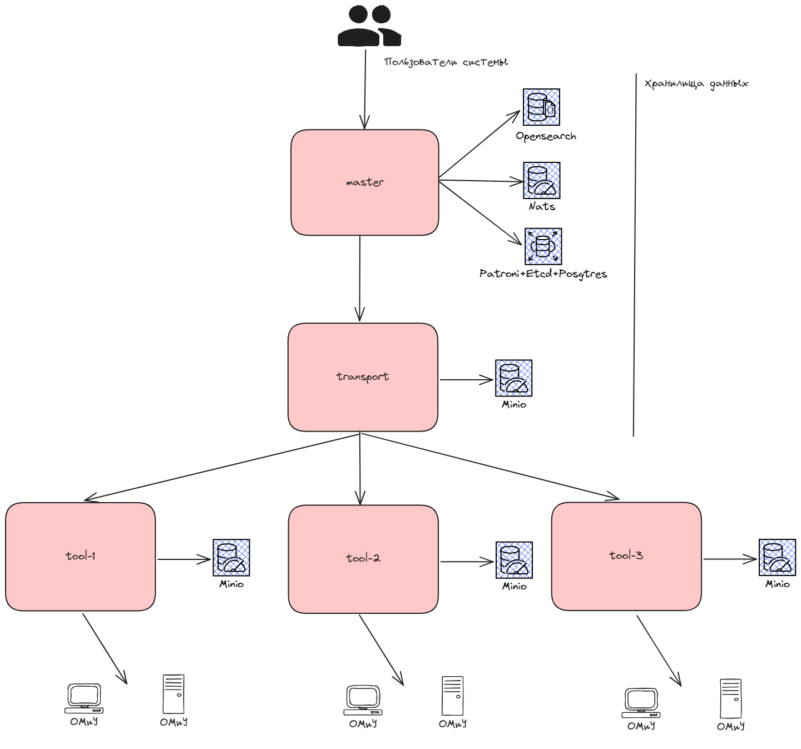
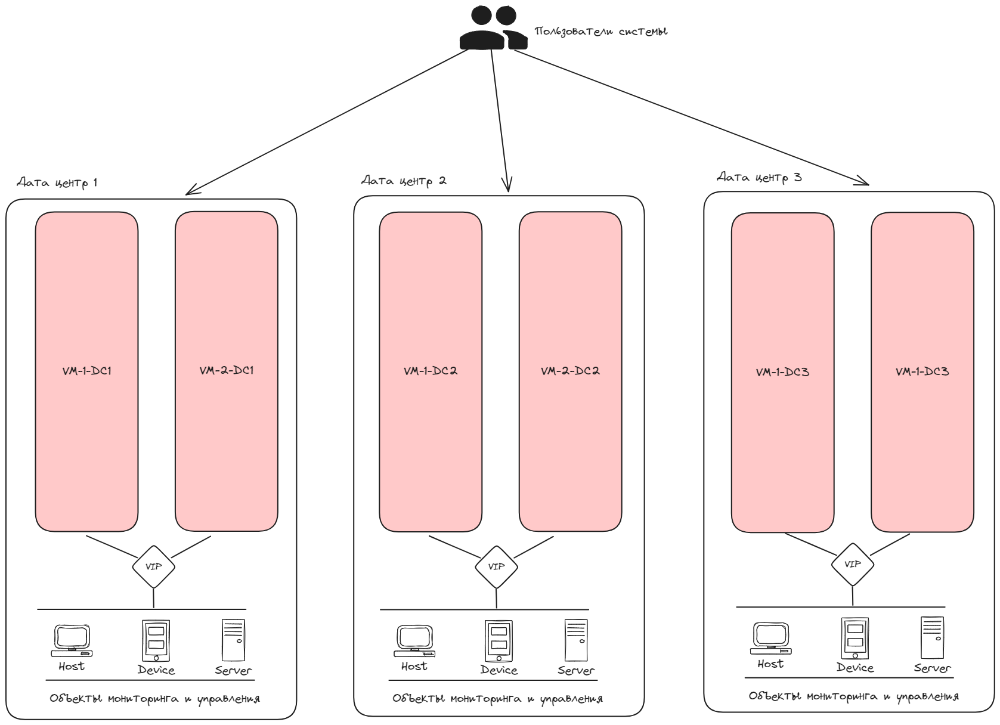

# Руководство по инсталляции EMS v4.2.1 в режиме HA на 3 дата-центра

EMS в режиме HA - это конфигурация системы EMS для проведения инсталляции на 6 нодах (в различных дата-центрах) режиме active-active с автоматическим восстановлением после падения 1-2 нод.

Руководство описывает 2 варианта инсталляции:

- Базовая установка - быстрый старт для ознакомления с системой или тестирования
- Промышленная установка - установка для промышленного использования

## Содержание

- [Руководство по инсталляции EMS v4.2.1 в режиме HA на 3 дата-центра](#руководство-по-инсталляции-ems-v420-в-режиме-ha-на-3-дата-центра)
  - [Содержание](#содержание)
  - [Требования к техническому обеспечению](#требования-к-техническому-обеспечению)
    - [Требования к дисковой подсистеме](#требования-к-дисковой-подсистеме)
    - [Требования к CPU](#требования-к-cpu)
    - [Требования к RAM](#требования-к-ram)
    - [Требования к сети](#требования-к-сети)
    - [Контрольный список готовности к инсталляции](#контрольный-список-готовности-к-инсталляции)
  - [Базовая установка системы](#базовая-установка-системы)
    - [Подготовка окружения для базовой установки системы](#подготовка-окружения-для-базовой-установки-системы)
    - [Подготовка виртуальных машин](#подготовка-виртуальных-машин)
    - [Базовая установка компонентов системы](#базовая-установка-компонентов-системы)
  - [Описание компонентов системы](#описание-компонентов-системы)
    - [Инсталляционный пакет](#инсталляционный-пакет)
    - [Инсталляционный пакет Executable](#инсталляционный-пакет-executable)
    - [Инсталляционный пакет Master](#инсталляционный-пакет-master)
    - [Инсталляционный пакет Transport](#инсталляционный-пакет-transport)
    - [Инсталляционный пакет Tool](#инсталляционный-пакет-tool)
    - [Компоненты центральной группы](#компоненты-центральной-группы)
    - [Компоненты транспортной группы](#компоненты-транспортной-группы)
    - [Компоненты инструментальной группы](#компоненты-инструментальной-группы)
  - [Промышленная установка системы](#промышленная-установка-системы)
    - [Подготовка окружения для промышленной установки системы](#подготовка-окружения-для-промышленной-установки-системы)
    - [Подготовка виртуальных машин для промышленной установки системы](#подготовка-виртуальных-машин-для-промышленной-установки-системы)
      - [Установка корневого сертификата](#установка-корневого-сертификата)
      - [Настройка интеграции центральной группы компонентов с Telegram](#настройка-интеграции-центральной-группы-компонентов-с-telegram)
    - [Промышленная установка транспортной группы компонентов](#промышленная-установка-транспортной-группы-компонентов)
  - [Проверка сценариев отказа системы](#проверка-сценариев-отказа-системы)
    - [Остановка виртуальной машины](#остановка-виртуальной-машины)
    - [Сетевая изоляция или отказ дата центра](#сетевая-изоляция-или-отказ-дата-центра)
    - [Восстановление нод после отказа](#восстановление-нод-после-отказа)
  - [Остановка системы](#остановка-системы)
  - [Запуск системы после остановки](#запуск-системы-после-остановки)
  - [Удаление системы](#удаление-системы)
  - [Обновление системы](#обновление-системы)


## Требования к техническому обеспечению

Рекомендованные системные требования к аппаратному обеспечению приведены ниже.

### Требования к дисковой подсистеме

В виду того, что EMS использует высокопроизводительные системы хранения данных, к дисковой подсистеме предъявляются строгие требования:

* Дисковая подсистема должна обеспечивать производительность не менее 15000 IOPS (количество операций ввода-вывода в секунду);
* Для обеспечения оптимальной производительности и стабильности Системы, настоятельно рекомендуется избегать использования сетевых файловых систем в качестве основного хранилища узлов. Применение сетевых файловых систем может привести к снижению производительности кластера, вплоть до потери функциональности;
* Для хранения узлов рекомендуется использовать локальные твердотельные накопители (SSD), установленные непосредственно на физический хост. Это гарантирует повышение эффективности работы Системы и уменьшение вероятности возникновения технических проблем, связанных с хранением данных;
* Рекомендованный необходимый объем дискового пространства для Системы, **без учета пространства занимаемого ОС** и прикладным ПО составляет не менее 200 GB;
* Для корректной работы Системы рекомендуется использовать разметку, при которой все пространство выделено под корневой раздел `/`;
* При наличии особой разметки дисков следует удостовериться что:
  * Для базовой установки:
    1. В каталоге установки Системы `/opt` доступно не менее 15 GB.
    2. `Docker` для хранения данных, по умолчанию `/var/lib/docker` доступно не менее 175 GB.
    3. В каталоге первоначального размещения инсталляционного пакета `/root` доступно не менее 10 GB.
  * Для промышленной установки:
    1. В каталоге установки Системы `/opt` доступно не менее 15 GB.
    2. `Docker` для хранения данных, по умолчанию `/var/lib/docker` доступно не менее 275 GB.
    3. В каталоге первоначального размещения инсталляционного пакета `/root` доступно не менее 10 GB.

### Требования к CPU

К CPU предъявляются строгие требования:
* На каждой ноде должно быть не менее 20 vCPU;
* 64-разрядный процессор с тактовой частотой не менее 2000 Hz.


### Требования к RAM

К RAM предъявляются строгие требования:
* На каждой ноде должно быть доступно не менее 20 Gb;
* Версия - не ниже DDR4;
* Тип ECC (код исправления ошибок) или аналогичная технология.

### Требования к сети

Между нодами кластера должно быть обеспечено сетевое соединение со скоростью не 
менее 1 гигабит в секунду.


### Контрольный список готовности к инсталляции

> <font color="red">**Внимание:** Прежде чем приступать к инсталляции EMS, необходимо по контрольному списку успешно пройти проверку готовности инфраструктуры к началу инсталляции ЕМС</font>

* Требования к пользователю
  - Пользователь ознакомился с сопутствующей документацией:
    - [ ] Руководство администратора Системы EMS v4.2.1;
    - [ ] Руководство по инсталляции EMS v4.2.1 в режиме HA на 3 дата-центра.
* Требования к аппаратному обеспечению:
  - Характеристики сервера соответствуют системным требованиям:
    - [ ] Процессоры 64-разрядные с тактовой частотой не менее 2 Ггц;
    - [ ] Память как минимум DDR4 или выше, тип ECC (код исправления ошибок) или аналогичная технология;
    - [ ] Дисковая система построена на SSD и обеспечивает производительность не менее 15000 IOPS (количество операций ввода-вывода в секунду);
    - Разметка разделов дисковой системы для HA конфигурации EMS промышленной установки:
      - [ ] Раздел "/opt" имеет объем не менее 15 Гб;
      - [ ] Раздел "/var" имеет объем не менее 275 Гб;
      - [ ] Раздел "/root" имеет объем не менее 10 Гб.
  - Характеристики виртуальных машин сервера соответствуют системным требованиям:
    - Для HA конфигурации EMS промышленной установки:
      - Для **manager-node1**:
        - [ ] Выделено не менее 20 vCPU на ноду;
        - [ ] Выделено не менее 24 Гб памяти на ноду;
        - [ ] Выделено не менее 300 Гб (значение должно быть доступно `Системе` и приложению `docker`; объем пространства необходимого ОС не учитывается в заданном значении).
      - Для **manager-node2**:
        - [ ] Выделено не менее 20 vCPU на ноду;
        - [ ] Выделено не менее 24 Гб памяти на ноду;
        - [ ] Выделено не менее 300 Гб (значение должно быть доступно `Системе` и приложению `docker`; объем пространства необходимого ОС не учитывается в заданном значении).
      - Для **manager-node3**:
        - [ ] Выделено не менее 20 vCPU на ноду;
        - [ ] Выделено не менее 24 Гб памяти на ноду;
        - [ ] Выделено не менее 300 Гб (значение должно быть доступно `Системе` и приложению `docker`; объем пространства необходимого ОС не учитывается в заданном значении).
      - Для **manager-node4**:
        - [ ] Выделено не менее 20 vCPU на ноду;
        - [ ] Выделено не менее 24 Гб памяти на ноду;
        - [ ] Выделено не менее 300 Гб (значение должно быть доступно `Системе` и приложению `docker`; объем пространства необходимого ОС не учитывается в заданном значении).
      - Для **manager-node5**:
        - [ ] Выделено не менее 20 vCPU на ноду;
        - [ ] Выделено не менее 24 Гб памяти на ноду;
        - [ ] Выделено не менее 300 Гб (значение должно быть доступно `Системе` и приложению `docker`; объем пространства необходимого ОС не учитывается в заданном значении).
      - Для **manager-node6**:
        - [ ] Выделено не менее 20 vCPU на ноду;
        - [ ] Выделено не менее 24 Гб памяти на ноду;
        - [ ] Выделено не менее 300 Гб (значение должно быть доступно `Системе` и приложению `docker`; объем пространства необходимого ОС не учитывается в заданном значении).
* Требования к сетевой инфраструктуре:
  - [ ] Между нодами кластера обеспечено сетевое соединение со скоростью не менее 1 гигабит в секунду;
  - Сетевые порты, необходимые для работы ЕМС, свободны:
    - Для HA конфигурации EMS:
      - [ ] Открыт порт 443/tcp;
      - [ ] Открыт порт 52004/tcp;
      - [ ] Открыт порт 21890/tcp;
      - [ ] Открыт порт 389/tcp;
      - [ ] Открыт порт 636/tcp;
      - [ ] Открыт порт 514/udp;
      - [ ] Открыт порт 601/tcp;
      - [ ] Открыт порт 6514/udp;
      - [ ] Открыт порт 6514/tcp;
      - [ ] Открыт порт 80/tcp;
      - [ ] Открыт порт 80/udp;
      - [ ] Открыт порт 67/udp;
      - [ ] Открыт порт 69/udp;
      - [ ] Открыт порт 5101/tcp;
      - [ ] Открыт порт 9000/tcp;
      - [ ] Открыт порт 2222/tcp;
      - [ ] Открыт порт 9333/tcp;
      - [ ] Открыт порт 5333/tcp;
      - [ ] Открыт порт 44222/tcp;
      - [ ] Открыт порт 7071/tcp;
      - [ ] Открыт порт 4317/tcp;
      - [ ] Открыт порт 52003/tcp;
      - [ ] Открыт порт 52221/tcp;
      - [ ] Открыт порт 52222/tcp;
      - [ ] Открыт порт 52223/tcp;
      - [ ] Открыт порт 52224/tcp;
      - [ ] Открыт порт 52225/tcp;
      - [ ] Открыт порт 5000/tcp;
      - [ ] Открыт порт 7091/tcp;
      - [ ] Открыт порт 7092/tcp;
      - [ ] Открыт порт 7093/tcp;
      - [ ] Открыт порт 7094/tcp;
      - [ ] Открыт порт 7095/tcp;
      - [ ] Открыт порт 25/tcp;
      - [ ] Открыт порт 22/tcp;
      - [ ] Открыт порт 53/tcp.
* Требования к программному обеспечению:
  - ПО сервера соответствуют системным требованиям:
    - Версия ОС соответствует требованиям (для текущего пункта достаточно одного проставленного чекбокса);
    - Для HA конфигурации EMS:
      - [ ] Oracle 8.9 Server Minimal.
    - Версия Docker соответствует требованиям;
      - Для HA конфигурации EMS:
        - [ ] Версия Docker 2.0.7.
    - [ ] Отключен фаервол.
  - Лицензия соответствует требованиям по подготовке к инсталляции:
    - [ ] Актуальная лицензия получена;
    - [ ] CLIENT_NAME в ems.config соответствует лицензии;
    - [ ] Срок истечения лицензии не вышел.

> <font color="red">**Внимание:** Функционирование гарантировано при использовании конфигурации docker по умолчанию. Если в компании приняты какие-либо стандарты конфигурирования ПО docker, в случае возникновения  проблем с запуском EMS, исправьте настройки docker для обеспечения работоспособности EMS или верните настройки docker по умолчанию. В случае наличия корпоративных политик по обновлению используемых программных продуктов и их компонентов, необходимо поставить данное ПО как исключение для ограничения обновлений</font>

## Базовая установка системы

В данном разделе описывается процесс быстрой установки системы для организации тестового контура, ознакомления с функционалом и проверки работоспособности системы.

### Подготовка окружения для базовой установки системы

Подготовьте 6 виртуальных машин с ОС Oracle Linux 8.9, установите на них docker версии 24.0.7, а также плагин docker-buildx-plugin версии 0.13.1.

Виртуальные машины должны быть соединены сетевым каналом пропускной способностью не менее 1GB.

Установка производится из под пользователя `root`.

Каждая из 6 виртуальных машин должна иметь ресурсную конфигурацию:

| vCPU | RAM | SSD    |
| ---- | --- | ------ |
| 20   | 24  | 200 GB |

Обратите внимание, дисковое пространство должно быть доступно для хранения данных в директориях:

- `/root` - хранение инсталляционного пакета
- `/opt` - хранение инсталляционного пакета
- `/var/lib/docker` - хранение образов и вольюмов docker

На каждой ноде необходимо выполнить следующую команду:

```bash
mknod /dev/loop0 b 7 0
```

Для того, чтобы изменения сохранялись после перезагрузки ВМ необходимо выполнить следующие команды:

Создайте и откройте файл `/etc/tmpfiles.d/loop.conf`:

```bash
vi /etc/tmpfiles.d/loop.conf
```

Добавьте в него `b! /dev/loop0  0660  root  disk  -  7:0`, для сохранения изменений и выхода из редактора нажмите `<ESC>`, редактор переведется в режим команд, после чего введите `:wq`, и нажмите `<Enter>` (для редакторов `vi` и `vim`).

Так же отключите файрвол на каждой ноде:

```bash
systemctl disable --now firewalld
```

На каждой ноде создайте файл `/etc/sysctl.d/ems.conf` и добавьте в него параметры ядра, применив их:

```bash
echo 'vm.max_map_count=262144
vm.overcommit_memory=1' > /etc/sysctl.d/ems.conf && sysctl --system
```

### Подготовка виртуальных машин

Распакуйте инсталляционный пакет на всех нодах в директории `/opt/ems`.

Откройте файл `/opt/ems/master/.env` в качестве значения переменной `CLIENT_NAME` укажите значение из файла лицензий.

Полученный файл лицензий переименуйте в `license.json`, поместите его в директорию `/opt/ems/master/config/`.

Аналогичные действия повторите на всех нодах или сделайте эти изменения заранее, перед размещением инсталляционного пакета.

На всех нодах выполните команду:

```bash
docker load -i /opt/ems/images.tar.gz
```

Выберите 1 из нод в качестве рабочей, большая часть операций будет производится именно с нее. Может быть выбрана любая из 6.

Зайдите на рабочую ноду и инициализируйте кластер:

```bash
docker swarm init > /dev/null && docker swarm join-token manager && docker swarm join-token worker
```

В терминал будет выведено 2 команды, сохраните этот вывод, он необходим для подключения в кластер остальных нод.

Например:

```bash
To add a manager to this swarm, run the following command:

    docker swarm join --token SWMTKN-1-5i5amrfywc8j0kiayyeyd8le2j9efonr6q1sk0aq01w22otevc-a7r7jxr8gz25n3tfmjckvi16z 192.168.1.234:2377

To add a worker to this swarm, run the following command:

    docker swarm join --token SWMTKN-1-5i5amrfywc8j0kiayyeyd8le2j9efonr6q1sk0aq01w22otevc-8wnaekv9767vmtr8l7ry5is78 192.168.1.234:2377
```

Выполните сборку образа для запуска утилит:

```bash
chmod -R +x /opt/ems/executable
/opt/ems/executable/swarmer/tool_build.sh
```

Зайдите на следующие 4 ноды, выполните первую из команд, полученных на инициализации кластера, например:

```bash
docker swarm join --token SWMTKN-1-5i5amrfywc8j0kiayyeyd8le2j9efonr6q1sk0aq01w22otevc-a7r7jxr8gz25n3tfmjckvi16z 192.168.65.4:2377
```

Также выполните сборку образа для запуска утилит на этих нодах:

```bash
chmod -R +x /opt/ems/executable
/opt/ems/executable/swarmer/tool_build.sh
```

Зайдите на последнюю ноду, выполните вторую из команд, полученных на инициализации кластера, например:

```bash
docker swarm join --token SWMTKN-1-5i5amrfywc8j0kiayyeyd8le2j9efonr6q1sk0aq01w22otevc-8wnaekv9767vmtr8l7ry5is78 192.168.65.4:2377
```

> Внимание: на IP адресе ноды с ролью Worker интерфейс системы не доступен!

Также выполните сборку образа для запуска утилит на этой ноде:

```bash
chmod -R +x /opt/ems/executable
/opt/ems/executable/swarmer/tool_build.sh
```

Вернитесь на рабочую ноду, остальные шаги будут выполняться там.

Промаркируйте ноды для корректного расположения компонентов системы:

```bash
/opt/ems/executable/swarmer/mark_nodes.sh
```

Просмотрите итоговое кол-во ресурсов, убедитесь что их достаточно и что все ноды были подключены к кластеру:

```bash
/opt/ems/executable/swarmer/check_nodes.sh
docker node ls
```

### Базовая установка компонентов системы

Зайдите на рабочую ноду.

Запустите скрипт:

```bash
/opt/ems/executable/swarmer/up.sh dc1 dc2 dc3
```

Где `dc1 dc2 dc3` - названия tool-кластеров дата центров.

Подождите около 10-15 минут, убедитесь, что все сервисы поднялись:

```bash
watch -c 'docker service ps $(docker service ls -q) | grep Running'
```

Откройте браузер и проверьте доступность веб-интерфейса для этого перейдите на адрес `https://{ip любой менеджер ноды}/`, выполните вход в систему (Логин: `SuperAdmin`, Пароль: `aA123123@`).

> Внимание: на IP адресе ноды с ролью Worker интерфейс системы не доступен!

Выдайте права доступа к инструментальным кластерам, перелогиньтесь в системе, убедитесь, что система корректно определила статус здоровья всех кластеров (вкладка в системе 'Проводник', подробнее в рук-ве пользователя).

## Описание компонентов системы

Система состоит из 3 групп компонентов

- Центральная группа - группа компонентов, реализующая пользовательский интерфейс системы и обеспечивающая механизмы хранения пользовательских данных. В инсталляционном пакете представлена как - master-cluster.
- Транспортная группа - группа компонентов, обеспечивающая коммуникацию между остальными компонентами системы. В инсталляционном пакете представлена как - transport-cluster.
- Инструментальная группа - группа компонентов, реализующая процессы управления и мониторинга ОМиУ. В инсталляционном пакете представлена как - tool-cluster.

Логическая диаграмма взаимодействия компонентов системы:



### Инсталляционный пакет

Инсталляционный пакет для данной конфигурации состоит из директорий:

- executable - набор скриптов для автоматизации процесса инсталляции
- master - инсталлятор для компонентов центральной группы компонентов
- tool - инсталлятор для компонентов инструментальной группы компонентов
- transport - инсталлятор для компонентов транспортной группы компонентов

### Инсталляционный пакет Executable

Директория `executable` состоит из следующего набора скриптов:

- executable/check_nodes.sh - проверка ресурсов нод
- executable/mark_nodes.sh - последовательная установка лейблов на все ноды
- executable/master_destroy.sh - уничтожение центрального кластера с данными
- executable/seed_opt.sh - принудительное копирование пакета в директорию `/opt/ems`
- executable/stop.sh - остановка кластера по имени
- executable/tool_build.sh - сборка базового образа инструментального кластера
- executable/tool_destroy.sh - уничтожение инструментального кластера с данными
- executable/tool_stop.sh - остановка инструментального кластера
- executable/tool_up.sh - запуск инструментального кластера
- executable/transport_destroy.sh - уничтожение транспортного кластера с данными
- executable/up.sh - запуск кластера по имени

### Инсталляционный пакет Master

Директория `master` состоит из следующего набора файлов и директорий:

- master/config/excel_templates - шаблоны для генерации отчетов
- master/config/generators - генератор для конфигураций nats
- master/config/keys - ключи шифрования данных подключения к ОМиУ
- master/config/kv - конфигурация kv хранилища
- master/config/minio_seed - набор системных файлов для загрузки в файловое хранилище
- master/config/CA.crt - самоподписной сертификиат для базовой инсталляции
- master/config/leaf.creds - данные подключения к nats на транспортном кластере
- master/config/patroni.yaml - конфигурация patroni и postgres
- master/config/restic_password - пароль к restic бекапам
- master/config/step_password - пароль к step ca серверу
- master/compose.yaml - compose файл для запуска центральной группы
- master/.env - набор параметров для запуска центральной группы

### Инсталляционный пакет Transport

Директория `transport` состоит из следующего набора файлов и директорий:

- transport/config/acme_config - конфигурация для step ca сервера
- transport/config/leaf_config - конфигурация для nats на транспортном кластере
- transport/config/CA.crt - самоподписной сертификат для базовой инсталляции
- transport/config/CA.key - самоподписной сертификат для базовой инсталляции
- transport/config/password - пароль к step ca серверу
- transport/config/restic_password - пароль к restic бекапам
- transport/config/step_run.sh - entrypoint для step ca
- transport/generators - генераторы для конфигураций nats и step ca
- transport/compose.yaml - compose файл для запуска транспортной группы
- transport/.env - набор параметров для запуска транспортной группы

### Инсталляционный пакет Tool

Директория `tool` состоит из следующего набора файлов и директорий:

- tool/config/keys - ключи шифрования данных подключения к ОМиУ
- tool/config/glauth.cfg - базовая конфигурация SSO
- tool/config/leaf.creds - данные подключения к nats на транспортном кластере
- tool/config/restic_password - пароль к restic бекапам
- tool/config/sftp-proxy.json - конфигурация для sftp-proxy
- tool/config/step_password - пароль к step ca серверу
- tool/config/tool_auth - логин:пароль для компонентов инструментального кластера
- tool/runner - базовый образ для запуска инструментального кластера
- tool/runner/Dockerfile - Dockerfile базового образа для запуска инструментального кластера
- tool/runner/entry.sh - Entrypoint базового образа для запуска инструментального кластера
- tool/compose.yaml - compose файл для запуска инструментальной группы
- tool/tool.yaml - compose файл для запуска внутренних компонентов инструментальной группы
- tool/.env - набор параметров для запуска инструментальной группы

### Компоненты центральной группы

Центральная группа - это группа компонентов системы, реализующая пользовательский интерфейс системы и обеспечивающая механизмы хранения пользовательских данных. В инсталляционном пакете представлена как - master-cluster.

Данные система сохраняет в следующие хранилища:

- PostgreSQL - хранение основной информации о пользователях и оборудовании
- Opensearch - хранение статистической информации
- Nats - хранение неструктурированных данных

Список компонентов центральной группы:

- traefik - балансировщик нагрузки для работы с нодами opensearch
- patroni + postgresql - кластер postgres
- haproxy - балансировщик нагрузки для связки patroni + postgresql
- opensearch - кластер opensearch
- opensearch dashboard - ui для opensearch
- nats - брокер событий и kv-хранилище
- redis - pub/sub брокер
- license server - сервер лицензирования системы
- device-authory-center - компонент системы для работы с SSO на BMC консолях
- ui - ui для работы с системой
- ui-navigator - компонент системы, реализующий проводник
- api-gw - реверс-прокси и шлюз компонентов системы
- device-store - компонент системы, реализующий функционал работы с инвентарными данными оборудования
- device-metric-manager - компонент системы, реализующий функционал работы с статистическими данными оборудования
- system-store - компонент системы, реализующий функционал работы с инвентарными данными экземпляров сервисов
- system-metric-manager - компонент системы, реализующий функционал работы с статистическими данными экземпляров сервисов
- user-service - компонент системы, реализующий функционал прав доступа и нотификации
- task-service - компонент системы, реализующий функционал планирования задач управления и мониторинга
- repository-service - компонент системы, реализующий функционал хранения файлов
- network-watcher - компонент системы, реализующий функционал автодискаверинга
- watchdog - компонент системы, реализующий функционал селф-мониторинга
- report-scripts - компонент системы, реализующий функционал отчетности
- docs - компонент системы, предоставляющий доступ к внутренней документации системы

### Компоненты транспортной группы

Транспортная группа - это группа компонентов, обеспечивающая коммуникацию между остальными компонентами системы. В инсталляционном пакете представлена как - transport-cluster.

Список компонентов транспортной группы:

- nats - межкомпонентный брокер событий
- traefik - реверс-прокси транспортной группы
- step-ca - компонент системы, реализующий функционал сертификации системы (протокол `acme`)
- minio - ec-кластер минио в режиме 6 нод, 1 диск на ноду, является центральным хранилищем файлов системы
- socket-hub - компонент системы, отвечающий за коммуникацию между центральным и инструментальными группами компонентов
- watchdog - компонент системы, реализующий функционал селф-мониторинга

### Компоненты инструментальной группы

Инструментальная группа - группа компонентов, реализующая процессы управления и мониторинга ОМиУ. В инсталляционном пакете представлена как - tool-cluster.

Список компонентов инструментальной группы:

- minio - локальное хранилище файлов
- nats - локальный брокер событий
- redis - локальное хранилище кеша
- sftp-proxy - прокси-сервер SFTP -> S3
- device-authory-center - компонент системы для работы с SSO на BMC консолях
- syslog-getter - компонент системы для получения логов от оборудования по протоколу syslog
- dispatcher - компонент системы для диспатчинга подключения к оборудования
- cacher - компонент системы для кеширования данных о подключениях
- ipmi-handler - компонент системы для работы с оборудованием по протоколу IPMI
- snmp-handler - компонент системы для работы с оборудованием по протоколу SNMP
- wmi-handler - компонент системы для работы с оборудованием по протоколу WMI
- ssh-handler - компонент системы для работы с оборудованием по протоколу SSH
- redfish-handler - компонент системы для работы с оборудованием по протоколу REDFISH
- fping-handler - компонент системы для работы с оборудованием по протоколу ICMP
- hypervisor-handler - компонент системы для работы с гипервизорами оборудования
- netboot-handler - компонент системы для работы с оборудованием по протоколу PXE
- syslog-handler - компонент системы, реализующий обработку syslog событий
- firmware-updater - компонент системы, реализующий функционал обновления прошивок оборудования
- dhcp-heathchecker - компонент системы, реализующий проверку работоспособности DHCP для работы по протоколу PXE
- backup-handler - компонент системы, реализующий функционал бэкапов конфигураций коммутаторов
- watchdog - компонент системы, реализующий функционал селф-мониторинга
- ssh-web-console - компонент системы, реализующий функционал эмулятора терминал в ui системы
- os-manager - компонент системы, реализующий функционал управления операционными системами оборудования
- smart-handler - компонент системы, реализующий функционал SMART мониторинга
- service-monitoring - компонент системы, реализующий функционал мониторинга экземпляров сервисов
- socket-hub - компонент системы, отвечающий за коммуникацию между центральным и инструментальными группами компонентов

## Промышленная установка системы

В даном разделе описывается инсталляция следующей конфигурации:



Допускается отказ 2 любых нод с сохранением функционалности системы, с 2 примечаниями:

- В случае отказа 2 нод в 1 дата центре мониторинг и управление ОМиУ в дата центре будет невозможен
- Восстановление работоспособности системы происходит в течении 10 минут, после отказа нод
- Использование VIP является опциональным, необходимо для сохранения функционирования агентов на ОМиУ и функционала SSO без переустановки, после падения нод

### Подготовка окружения для промышленной установки системы

Подготовьте 6 виртуальных машин с ОС Oracle Linux 8.9, установите на них docker версии 24.0.7, а также плагин docker-buildx-plugin версии 0.13.1.

Виртуальные машины должны быть соединены сетевым каналом пропускной способностью не менее 1GB.

Целевые ОМиУ в каждом DC должны находиться в одной сети с виртуальными машинами, в случае, если планируется использовать функционал установки ОС по PXE

Установка производится из под пользователя `root`.

Каждая из 6 виртуальных машин должна иметь ресурсную конфигурацию:

| vCPU | RAM | SSD    |
| ---- | --- | ------ |
| 20   | 24  | 300 GB |

Обратите внимание, дисковое пространство должно быть доступно для хранения данных в директориях:

- `/root` - хранение инсталляционного пакета
- `/opt` - хранение инсталляционного пакета
- `/var/lib/docker` - хранение образов и вольюмов docker

На каждой ноде необходимо выполнить следующую команду:

```bash
mknod /dev/loop0 b 7 0
```

Для того, чтобы изменения сохранялись после перезагрузки ВМ необходимо выполнить следующие команды:

Создайте и откройте файл `/etc/tmpfiles.d/loop.conf`:

```bash
vi /etc/tmpfiles.d/loop.conf
```

Добавьте в него `b! /dev/loop0  0660  root  disk  -  7:0`, для сохранения изменений и выхода из редактора нажмите `<ESC>`, редактор переведется в режим команд, после чего введите `:wq`, и нажмите `<Enter>` (для редакторов `vi` и `vim`).

Так же отключите файрвол на каждой ноде:

```bash
systemctl disable --now firewalld
```

На каждой ноде создайте файл `/etc/sysctl.d/ems.conf` и добавьте в него параметры ядра, применив их:

```bash
echo 'vm.max_map_count=262144
vm.overcommit_memory=1' > /etc/sysctl.d/ems.conf && sysctl --system
```

### Подготовка виртуальных машин для промышленной установки системы

Распакуйте инсталляционный пакет на всех нодах в директории `/opt/ems`.

Откройте файл `/opt/ems/master/.env` в качестве значения переменной `CLIENT_NAME` укажите значение из файла лицензий, в качестве значения переменной `EMS_HOSTNAME` укажите DNS системы, в случае, если выдача DNS имени не планируется, введите любое валидное значение DNS имени, например `ems.company`.

Полученный файл лицензий переименуйте в `license.json`, поместите его в директорию `/opt/ems/master/config/`.

Аналогичные действия повторите на всех нодах или сделайте эти изменения заранее, перед размещением инсталляционного пакета.

На всех нодах выполните команду:

```bash
docker load -i /opt/ems/images.tar.gz
```

Выберите 1 из нод в качестве рабочей, большая часть операций будет производится именно с нее. Может быть выбрана любая из 6.

Зайдите на рабочую ноду и инициализуйте кластер:

```bash
docker swarm init && docker swarm join-token manager && docker swarm join-token worker
```

В терминал будет выведено 2 команды, сохраните этот вывод, он необходим для подключения в кластер остальных нод.

Например:

```bash
To add a manager to this swarm, run the following command:

    docker swarm join --token SWMTKN-1-5i5amrfywc8j0kiayyeyd8le2j9efonr6q1sk0aq01w22otevc-a7r7jxr8gz25n3tfmjckvi16z 192.168.1.234:2377

To add a worker to this swarm, run the following command:

    docker swarm join --token SWMTKN-1-5i5amrfywc8j0kiayyeyd8le2j9efonr6q1sk0aq01w22otevc-8wnaekv9767vmtr8l7ry5is78 192.168.1.234:2377
```

Выполните сборку образа для запуска утилит:

```bash
chmod -R +x /opt/ems/executable
/opt/ems/executable/swarmer/tool_build.sh
```

Зайдите на следующие 4 ноды, выполните первую из команд, полученных на инициализации кластера, например:

```bash
docker swarm join --token SWMTKN-1-5i5amrfywc8j0kiayyeyd8le2j9efonr6q1sk0aq01w22otevc-a7r7jxr8gz25n3tfmjckvi16z 192.168.65.4:2377
```

Также выполните сборку образа для запуска утилит на этих нодах:

```bash
chmod -R +x /opt/ems/executable
/opt/ems/executable/swarmer/tool_build.sh
```

Зайдите на последнюю ноду, выполните вторую из команд, полученных на инициализации кластера, например:

```bash
docker swarm join --token SWMTKN-1-5i5amrfywc8j0kiayyeyd8le2j9efonr6q1sk0aq01w22otevc-8wnaekv9767vmtr8l7ry5is78 192.168.65.4:2377
```

> Внимание: на IP адресе ноды с ролью Worker интерфейс системы не доступен!

Также выполните сборку образа для запуска утилит на этой ноде:

```bash
chmod -R +x /opt/ems/executable
/opt/ems/executable/swarmer/tool_build.sh
```

Вернитесь на рабочую ноду, остальные шаги будут выполняться там.

Промаркируйте ноды для корректного расположения компонентов системы. Для этого выполните команду:

```bash
docker node ls
```

Будет выведен список нод, ориентируясь на их хостнеймы выставите лейблы `dc` и `data` и используя команды:

```bash
docker node update --label-add dc=DC ID
docker node update --label-add data=DATA ID
```

Например для вывода `docker node ls`:

```bash
ID                            HOSTNAME                        STATUS    AVAILABILITY   MANAGER STATUS   ENGINE VERSION
gtixfx504y3ua02hxe31o88jo     ems-my-data-center-node          Ready     Active         Reachable        24.0.7
puvsf9z68duy39ahin22eehg4     ems-my-any-data-center-node      Ready     Active                          24.0.7
8bwzq6vlqvu9ojabbvkt0dcln     ems-dc2-1                        Ready     Active         Reachable        24.0.7
x3a4itq8of33l2bvjbv02h3v1     ems-dc2-2                        Ready     Active         Reachable        24.0.7
eunu3gm38wmiaq4c3nbuekvs2     ems-data-center-node             Ready     Active         Leader           24.0.7
osdf0ro6yvd79trt0oqvegm9t *   ems-data-center-node             Ready     Active         Reachable        24.0.7
```

Это будет набор команд:

```bash
docker node update --label-add dc=1 gtixfx504y3ua02hxe31o88jo
docker node update --label-add data=1 gtixfx504y3ua02hxe31o88jo
docker node update --label-add dc=1 puvsf9z68duy39ahin22eehg4
docker node update --label-add data=2 puvsf9z68duy39ahin22eehg4

docker node update --label-add dc=2 8bwzq6vlqvu9ojabbvkt0dcln
docker node update --label-add data=3 8bwzq6vlqvu9ojabbvkt0dcln
docker node update --label-add dc=2 x3a4itq8of33l2bvjbv02h3v1
docker node update --label-add data=4 x3a4itq8of33l2bvjbv02h3v1

docker node update --label-add dc=3 eunu3gm38wmiaq4c3nbuekvs2
docker node update --label-add data=5 eunu3gm38wmiaq4c3nbuekvs2
docker node update --label-add dc=3 osdf0ro6yvd79trt0oqvegm9t
docker node update --label-add data=6 osdf0ro6yvd79trt0oqvegm9t
```

Где `dc=n` - номер цода, который будет использоваться при указании порядка имен tool-кластеров на этапе запуска системы.

Где `data=n` - номер ноды данных, который будет использоваться для привязки каждого экземлпяра БД к конкретной ноде. 

Просмотрите итоговое кол-во ресурсов, убедитесь что их достаточно:

```bash
/opt/ems/executable/swarmer/check_nodes.sh
docker node ls
```

#### Установка корневого сертификата

Сгенерируйте сертификат, который будет будет корневым для EMS, необходимы файлы `ca.crt` и `ca.key`.

Замените им стандартные сертификаты `/opt/ems/transport/config/acme_config/ca.crt`, `/opt/ems/transport/config/acme_config/ca.key`.

Для получения fingerprint вашего сертификата выполните команду:

```bash
docker run \
  -v /opt/ems/transport/config/acme_config/ca.crt:/home/certs/ca.crt \
  -v /opt/ems/transport/config/acme_config/ca.key:/home/certs/ca.key \
  -v /opt/ems/transport/config/step_password:/home/step/secrets/password \
  registry.bergen.tech/ems/deploy/step-ca:4.0.0-803f5368 \
  step certificate fingerprint /home/certs/ca.crt
```

Последняя строка вывода - ваш fingerprint.

Полученное значение нужно установить переменной `ACME_FINGERPRINT` в файлах `.env` во всех директориях `master`, `tool`, `transport`.

Также вы можете изменить перед созданием новой конфигурации пароль для подключения к центру сертификации, используя файл - `/opt/ems/transport/config/password`.

При его изменении не забудьте изменить пароль в файлах:

- `opt/ems/master/config/step_password`
- `opt/ems/tool/config/step_password`

А также переменную `ACME_PROVISIONER_PASSWORD` в файлах `.env` во всех директориях `master`, `tool`, `transport`.

#### Настройка интеграции центральной группы компонентов с Telegram

В системе имеется функционал отправки нотификаций в мессенджер Telegram, для настройки этого функционала необходимо выполнить следующие шаги:

1. Перейдите по ссылке <https://t.me/BotFather>. В мессенджере откроется специальный пользователь для создания бота
2. Отправьте команду: /newbot, для создания нового бота
3. Отправьте желаемое имя будущего бота
4. BotFather предоставит токен вашего бота, его необходимо сохранить
5. При необходимости установите ему аватар командой /setuserpic
6. Перейдите на рабочую ноду
7. Откройте файл `/opt/ems/master/.env`
8. В качестве значения для переменной `TELEGRAM_KEY` укажите полученный на шаге 4 токен
9. Повторите пункты 7-8 на остальных нодах

### Промышленная установка транспортной группы компонентов

Зайдите на рабочую ноду.

Запустите скрипт с указанием названий tool-кластеров, например:

```bash
/opt/ems/executable/swarmer/up.sh MyDc1 MyDc2 MyDc3
```

Где `MyDc1 MyDc2 MyDc3` - названия дата центров в соответсвии с их номерами для установки кластеров, указаный ранее в лейблах нод на шаге (Подготовка виртуальных машин для промышленной установки системы). А `MyDc1` - название инструментального кластера, которое будет обозначено в системе (название должно содержать только символы латинского алфавита в любом регистре и символ '-').

Подождите около 10-15 минут, убедитесь, что все сервисы поднялись:

```bash
watch -c 'docker service ps $(docker service ls -q) | grep Running'
```

Откройте браузер и проверьте доступность веб-интерфейса для этого перейдите на адрес `https://{ip любой мэнэджер ноды}/`, выполните вход в систему (Логин: `SuperAdmin`, Пароль: `aA123123@`).

> Внимание: на IP адресе ноды с ролью Worker интерфейс системы не доступен!

Выдайте права доступа к инструментальным кластерам, перелогиньтесь в системе, убедитесь, что система корректно определила статус здоровья всех кластеров (вкладка в системе 'Проводник', подробнее в рук-ве пользователя).

## Проверка сценариев отказа системы

После установки системы мы можем проверить 2 основных сценария отказа:

- Остановка виртуальной машины
- Сетевая изоляция или отказ дата центра

Перед проведением тестирования сценария отказа, убедитесь, что система была корректно установлена. Нет остановленных/перезапускающихся сервисов, статус компонентов в проводнике в норме (подробнее в рук-ве пользователя).

Данная инсталляция может выдержать падение 1-2х любых нод, при падении 3 нод и более система станет недоступна.

В случае падения нод, перед дальнейшими тестами отказоустойчивости, необходимо сначала произвести их восстановление.

Таким образом сценарий, представленный далее, не будет пройден:

1. Остановка нод 1 и 2
2. Восстановление ноды 1
3. Остановка ноды 3

### Остановка виртуальной машины

Выберите любую виртуальную машину (лучше с установленной инструментальной группой компонентов), остановите ее с помощью команды `shutdown --now` или `poweroff`.

Подождите 10 минут, откройте ui системы. Не должно быть ошибок на экране, все данные и окна должны быть доступны, статус компонентов системы должен быть в норме.

Откройте вторую ноду в дата центре, где выполнялась остановка, инструментальная группа компонентов должна быть перезапущена на этой ноде, все контейнеры должны быть запущены, не должно быть остановленных/перезапускающихся контейнеров.

Проверьте это с помощью команды:

```bash
docker ps -a | grep tool
```

### Сетевая изоляция или отказ дата центра

Выберите 2 виртуальных машины в 1 дата центре, остановите их с помощью команды:

```bash
shutdown --now
```

или остановите docker с помощью:

```bash
watch systemctl disable --now docker
```

Подождите 10 минут, откройте ui системы. Не должно быть ошибок на экране, все данные и окна должны быть доступны, статус инструментальной группы компонентов системы в выбранном дата центре должен быть красным.

### Восстановление нод после отказа

Включите ноды, если они были выключены или активируйте docker, если он был остановлен:

```bash
systemctl enable --now docker
```

Система присоединит ноды и восстановит свою функциональность в течении 5 минут.

Убедитесь, что:

- Нода включена (на нее можно зайти)
- На ноде запущен docker
- Через ip ноды можно получить доступ к UI-системы (за исключением worker-ноды)
- Все сервисы системы запущены

## Остановка системы

Для остановки системы (без удаления данных) откройте рабочую ноду, выполните скрипт остановки, с указанием ваших названий tool-кластеров, например:

```bash
/opt/ems/executable/swarmer/stop.sh MyDc1 MyDc2 MyDc3
```

Где `MyDc1 MyDc2 MyDc3` - названия дата центров в соответсвии с их номерами для установки кластеров, указаный ранее в лейблах нод на [шаге](#подготовка-виртуальных-машин-для-промышленной-установки-системы).

Затем зайдите на каждую ноду и выполните:

```bash
/opt/ems/executable/docker-compose --file /opt/ems/tool/tool.yaml --env-file /opt/ems/tool/.env down
```

## Запуск системы после остановки

Для запуска системы после остановки откройте рабочую ноду, запустите скрипт:

```bash
/opt/ems/executable/swarmer/up.sh MyDc1 MyDc2 MyDc3
```

Где `MyDc1 MyDc2 MyDc3` - названия дата центров в соответсвии с их номерами для установки кластеров, указаный ранее в лейблах нод на [шаге](#подготовка-виртуальных-машин-для-промышленной-установки-системы).

Подождите около 5-10 минут, убедитесь, что все сервисы поднялись:

```bash
watch -c 'docker service ps $(docker service ls -q) | grep Running'
```

Откройте браузер и проверьте доступность веб-интерфейса для этого перейдите на адрес `https://{ip любой мэнеджер ноды}/`, выполните вход в систему (Логин: `SuperAdmin`, Пароль: `aA123123@`).

> Внимание: на IP адресе ноды с ролью Worker интерфейс системы не доступен!

## Удаление системы

Для удаления системы (с удалением данных) выполните шаги из раздела [Остановка системы](#остановка-системы).

Затем зайдите на каждую ноду и выполните:

```bash
/opt/ems/executable/swarmer/destroy.sh
```


## Обновление системы


В данном разделе приведен алгоритм обновления существующей системы. 


Резервное копирование и восстановление ВМ

Перед началом обновления необходимо создать резервную копию всех ВМ кластера. Это обеспечит  возможность быстрого восстановления в случае возникновения проблем в процессе установки.

> <font color="red">**Внимание:** Резервное копирование ВМ может выполняться средствами гипервизора или специализированного ПО, если такое используется.</font>

Алгоритм использования резервных копий:

1. В случае нарушения последовательности обновления, необходимо:

- Восстановить ВМ из резервных копий;
- Повторить попытку установки.

2. В случае возникновения проблем, необходимо:

- Выполнить проверку ВМ на соответствие перечисленным требованиям;
- Проанализировать системные журналы на предмет наличия ошибок, относящихся к процессу обновления Системы EMS;
- Восстановить ВМ из резервной копии;
- Внести корректировки в настройки ОС, согласно выявленным проблемам;
- Создать резервную копию исправленного состояния ВМ;
- Повторить попытку установки.

Шаг 1. Остановка системы

Для остановки системы (без удаления данных) откройте рабочую ноду, выполните скрипт остановки, с указанием ваших названий tool-кластеров, например:

```bash
/opt/ems/executable/swarmer/stop.sh MyDc1 MyDc2 MyDc3
```

Где `MyDc1 MyDc2 MyDc3` - названия дата центров в соответсвии с их номерами для установки кластеров, указаный ранее в лейблах нод на [шаге](#подготовка-виртуальных-машин-для-промышленной-установки-системы).

Затем зайдите на каждую ноду и выполните:

```bash
/opt/ems/executable/docker-compose --file /opt/ems/tool/tool.yaml --env-file /opt/ems/tool/.env down
```


Шаг 2. Подготовка виртуальных машин для обновления системы

Сделайте резервную копию каталога системы командой

```bash
mv /opt/ems /opt/save.ems
```

Распакуйте инсталляционный пакет на всех нодах в директории `/opt/ems`.

Откройте файл `/opt/ems/master/.env` в качестве значения переменной `CLIENT_NAME` укажите значение из файла лицензий, в качестве значения переменной `EMS_HOSTNAME` укажите DNS системы, в случае, если выдача DNS имени не планируется, введите любое валидное значение DNS имени, например `ems.company`.

Скопируйте файл `license.json` из обновляемой системы и поместите его в директорию `/opt/ems/master/config/`.

```bash
cp /opt/save.ems/master/config/license.json /opt/ems/master/config
```

Аналогичные действия повторите на всех нодах или сделайте эти изменения заранее, перед размещением инсталляционного пакета.

На всех нодах выполните команду:

```bash
docker load -i /opt/ems/images.tar.gz
```


На каждой ноде выполните сборку образа для запуска утилит:

```bash
chmod -R +x /opt/ems/executable
/opt/ems/executable/swarmer/tool_build.sh
```


Шаг 3. Запуск обновленной системы

Зайдите на рабочую ноду.

Запустите скрипт с указанием названий tool-кластеров, например:

```bash
/opt/ems/executable/swarmer/up.sh MyDc1 MyDc2 MyDc3
```

Где `MyDc1 MyDc2 MyDc3` - названия дата центров. Важно чтобы имена кластеров совпадали с предыдущей установкой системы.

Подождите около 10-15 минут, убедитесь, что все сервисы поднялись:

```bash
watch -c 'docker service ps $(docker service ls -q) | grep Running'
```

Откройте браузер и проверьте доступность веб-интерфейса для этого перейдите на адрес `https://{ip любой мэнэджер ноды}/`, выполните вход в систему (По умолчанию используются Логин: `SuperAdmin`, Пароль: `aA123123@`).

> Внимание: на IP адресе ноды с ролью Worker интерфейс системы не доступен!

Убедитесь, что система корректно определила статус здоровья всех кластеров (вкладка в системе 'Проводник', подробнее в рук-ве пользователя). Так же убедитесь, что оборудование заведенное до обновления присутствует в системе.

